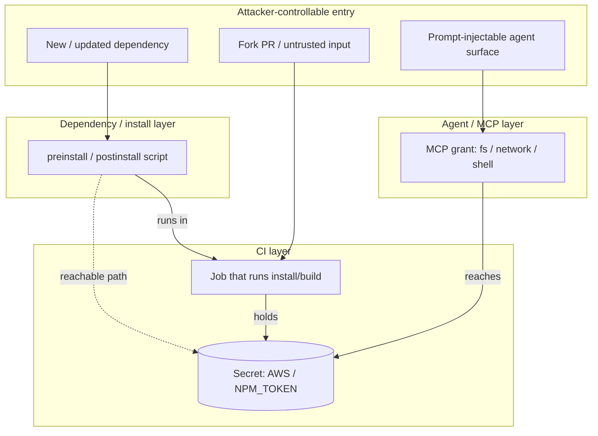
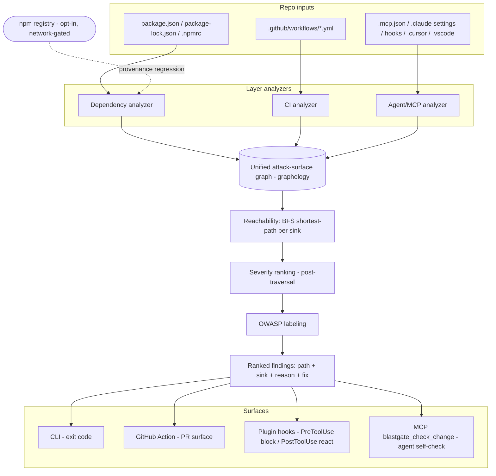
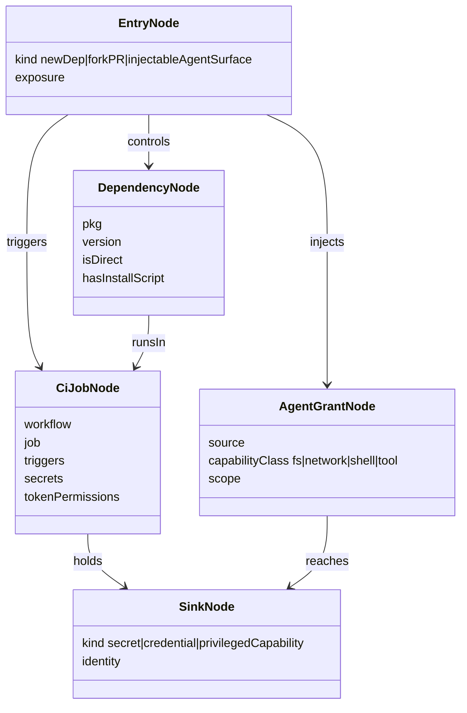

# Blastgate - Plan

## Goal Capsule

- **Objective:** Build Blastgate v1 — an open-source, npm-first attack-path engine that models a repo's cross-layer attack surface (dependencies/install-scripts + GitHub Actions jobs and their secrets + committed agent/MCP config) as one graph, fails on a reachable path from an attacker-controllable entry point to a sensitive sink (reporting the ranked path, the sink, why it is reachable, a fix, and the OWASP Agentic/MCP category), and ships that engine across three surfaces: a CI/PR gate, a local CLI, and a Claude Code plugin that gates changes inside the agent loop.
- **Product authority:** Repo owner (solo maintainer). Product decisions in the Product Contract are settled unless listed under Outstanding Questions.
- **Active scope:** The v1 npm-first scanner, exposed as a CI/PR gate, a local CLI, and a Claude Code plugin (hooks + MCP self-check + `/blastgate` command). Broader ecosystems, non-GitHub CI, and live-website scanning are out of scope (see Scope Boundaries).
- **Execution profile:** Greenfield TypeScript/Node package. Build unit-by-unit in dependency order; each Implementation Unit lands as its own atomic commit referencing its U-ID (per repo commit-per-ticket rule). Reachability logic and the cross-layer check engine are proved test-first against fixture repos.
- **Stop conditions:** Stop and surface if implementation reveals a change to product scope or a Product Contract requirement, or if research invalidates a settled Key Technical Decision. Do not silently re-scope.
- **Tail ownership:** `ce-work` (or a human implementer) owns build-and-ship; PRs follow repo conventions. This plan does not implement code.

---

## Product Contract

### Summary

Blastgate scans a repository and treats its attack surface as a testable assertion suite: it builds one graph across three layers — dependency/install-script nodes, CI job nodes annotated with the secrets and permissions each holds, and committed agent/MCP config nodes annotated with the capabilities they grant — and each check asserts that no reachable path connects an attacker-controllable entry point to a sensitive sink. A repo with no reachable path passes ("green"); a failure names the concrete path, the sink it reaches, why it is reachable, and a fix. It runs as a CI/PR gate, as a local CLI, and as a Claude Code plugin that blocks reachable-path changes inside the agent loop, and labels findings with the OWASP Agentic and MCP taxonomies.

### Problem Frame

Installing a dependency, or handing a coding agent shell access, is equivalent to executing untrusted code with the environment's authority. The Shai-Hulud npm worm weaponized exactly this: a `preinstall` hook that runs on `npm install`, sweeps npm/GitHub/AWS/Kubernetes/Vault secrets, and propagates. The damage is never the script alone — it is what the script can *reach* from wherever it executes.

Existing tooling is organized by layer, and each layer is well-served in isolation. Dependency/malware scanners (Socket, Aikido, Endor) answer "is this package bad." Actions-hardening tools (StepSecurity Harden-Runner, OpenSSF Scorecard's Dangerous-Workflow check) answer "is this workflow over-privileged." A wave of MCP/agent scanners (Invariant `mcp-scan`, Cisco `mcp-scanner`, `mcp-audit`) answer "is this agent config risky." The closest tool by breadth, StepSecurity Dev Machine Guard, inventories all three surfaces on one machine but describes itself as inventory-only — it reports *what is installed*, not what a compromise of it reaches, and does not touch credentials or attack paths.

The gap is the connective reasoning: no tool computes the *cross-layer reachable path* — "this new install script runs in this job that holds this secret that is exfiltratable because the job triggers on fork PRs." That path is invisible to any tool that sees only one layer. As of August 2026 the combination is unowned, and several vendors are moving toward it, so the window to be the reference implementation is roughly 6–12 months.

### Key Decisions

- KD1. **Teams + CI/PR gate as the surface.** (session-settled: user-directed — chosen over a solo local CLI: change-time gating in CI is where the value concentrates.) Governs R7.
- KD2. **All three layers unified in one graph**, not a single-vector wedge. (session-settled: user-directed — chosen over a deps-only or MCP-only scanner: the cross-layer reachable path is the differentiator no single-layer tool can compute.) Governs R1, R2, R3, R12.
- KD3. **Reasoning (graph reachability) over rules (syntactic linting).** The anti-dashboard bet — a check fails on a reachable path, never on mere presence of a pattern. (session-settled: user-approved.) Governs R4, R14.
- KD4. **Real repos plus the tool's own test coverage, over a staged failing demo.** (session-settled: user-directed — chosen over a crafted-vulnerable-demo hero artifact: credibility comes from solid reasoning, not theater.) Governs R13.
- KD5. **Success is establishing the cross-layer POV**, not adoption or precision-at-scale for v1. (session-settled: user-directed.) Governs R15; shapes Scope Boundaries.
- KD6. **Blast radius = CI secrets + repo-declared grants, not the developer's laptop credentials.** The CI-gate surface cannot see `~/.ssh` or `~/.aws`; reachable sinks are what CI and the repo declare. (session-settled: user-approved consequence.) Governs R3, R10.
- KD7. **npm-first for v1.** Shai-Hulud is an npm campaign; other ecosystems are deferred. (session-settled: user-approved.) Governs R9, R12.
- KD8. **Map findings to OWASP Agentic Top 10 (2026) and MCP Top 10** rather than inventing a taxonomy — adopt the emerging shared vocabulary. (session-settled: user-approved.) Governs R8.

The core object is one graph; a finding is a path through it:

### Requirements

**Attack-surface graph and findings**

- R1. Given a repo path, Blastgate builds a single attack-surface graph whose nodes come from three layers: dependency/install-script nodes; CI job nodes annotated with the secrets and token permissions each holds; and committed agent/MCP config nodes annotated with the filesystem, network, shell, and tool capabilities they grant.
- R2. Edges encode reachability — which node can cause or influence execution of, or access to, another (an install-script node runs within a job node; a job node holds a secret node; an agent grant reaches a capability).
- R3. A finding is a path from an attacker-controllable entry node (a newly added or updated dependency, a fork PR or other untrusted trigger, or a prompt-injectable agent surface) to a sensitive sink (a secret, credential, or privileged capability). Blastgate reports the shortest such path per sink.
- R4. Output is a small, severity-ranked set of real paths — not an unranked warning list. Ranking reflects sink sensitivity and how exposed the entry point is.

**Gate and test-suite behavior**

- R5. Each check is a pass/fail assertion. A repo with no reachable attacker-to-sink path passes; the healthy state is green.
- R6. A failing assertion names the concrete path, the sink it reaches, why the path is reachable, and a concrete remediation.
- R7. Blastgate runs as a CI gate (non-zero exit on failure, with the finding surfaced on the PR) and as a local CLI against the same repo, producing the same findings.
- R8. Every finding is labeled with its OWASP Agentic Top 10 (2026) and/or MCP Top 10 category.

**Layer coverage (npm-first, v1)**

- R9. Dependency/install layer: detect lifecycle scripts (`preinstall`/`install`/`postinstall`) added or changed, newly added dependencies, `.npmrc`/registry changes, and provenance regressions — a package that previously published with npm provenance now appearing without it.
- R10. CI layer: parse GitHub Actions workflows to determine which jobs run install/build steps, which hold secrets, and which are triggerable by untrusted input (`pull_request_target`, fork PRs); flag unpinned third-party actions and over-broad `GITHUB_TOKEN` permissions.
- R11. Agent/MCP layer: parse committed agent/MCP config to determine granted filesystem, network, shell, and tool capabilities, and flag grants that exceed a least-privilege baseline.
- R12. v1 covers a small, well-tested set of cross-layer checks spanning all three layers — enough to compute at least one genuine cross-layer path end-to-end (for example, install-script → secret-bearing job → exfiltratable secret) — rather than exhaustive per-layer rule coverage.

**Reasoning rigor and trust**

- R13. Blastgate ships its own test suite: fixture repos representing true-positive attack paths and true-negative safe configurations, asserting the engine's verdicts. The tool's own test coverage is a first-class deliverable.
- R14. Precision over recall for the gate: a check fails only on a genuinely reachable path. Syntactic presence alone (for example, a `postinstall` script existing) never fails a check without a reachable sink.

**Point-of-view artifact**

- R15. The repo ships a written articulation of the cross-layer attack-path model — a threat-model document — that positions Blastgate against inventory and single-layer tools and maps the model to the OWASP Agentic and MCP taxonomies.

**Agent-loop plugin surface (v1)**

- R16. Blastgate ships as a self-hosted Claude Code plugin whose hooks enforce the gate deterministically inside the agent loop: a `PreToolUse` hook blocks `git commit`/`git push` and edits to `package.json`, `.github/workflows/**`, and `.mcp.json` when the change would create a reachable attacker-to-sink path, with the ranked path, sink, and fix as the block message; a `PostToolUse` hook reacts to `npm install` after the fact and signals the agent to revert, since a dependency's install contents do not exist until the command runs.
- R17. The plugin also exposes the same engine as a `blastgate_check_change` MCP tool (the agent may self-check a proposed change before acting) and a `/blastgate` command (human-triggered full scan). The hook is the enforcement layer; the MCP tool and command are ergonomic and manual layers and are never the sole gate.

### Key Flows

- F1. CI/PR gate run
  - **Trigger:** A pull request is opened or updated (or a push to a protected branch).
  - **Steps:** Blastgate builds the attack-surface graph from the repo's manifests, lockfile, workflows, and agent/MCP config; computes reachable attacker-to-sink paths; ranks them; if any path meets the fail threshold, exits non-zero and surfaces the ranked path(s) with fixes on the PR; otherwise passes.
  - **Outcome:** Green means no reachable path. Red means one or more ranked paths, each with a sink and a fix. Per R7, a local CLI run over the same repo yields the same findings.

### Acceptance Examples

- AE1. Cross-layer true positive.
  - **Covers R3, R6, R10, R14.**
  - **Given:** A PR adds a `postinstall` script, the `test` job runs `npm ci` and holds `AWS_SECRET_ACCESS_KEY`, and `test` runs on pull requests from forks.
  - **Then:** Blastgate fails with a high-ranked path `postinstall (new) → test job (fork-triggerable) → AWS_SECRET_ACCESS_KEY`, and a fix (gate lifecycle scripts, or remove the secret from the untrusted job).
- AE2. Anti-false-positive true negative.
  - **Covers R4, R5, R14.**
  - **Given:** A `postinstall` script exists, but it runs only in a job that holds no secrets and is not fork-triggerable.
  - **Then:** The check passes — presence of the script alone does not fail the gate, because no sensitive sink is reachable.
- AE3. Provenance regression.
  - **Covers R9.**
  - **Given:** A lockfile update pulls a package version that lacks npm provenance where the prior version had it.
  - **Then:** Blastgate flags a provenance regression as a supply-chain entry-point signal.
- AE4. Agent over-privilege.
  - **Covers R11.**
  - **Given:** Committed MCP config grants an agent filesystem access beyond the repo root.
  - **Then:** Blastgate flags the grant against the least-privilege baseline and, where the agent surface is reachable, reports the path to out-of-repo access.
- AE5. Plugin pre-commit block.
  - **Covers R16.**
  - **Given:** Inside a Claude Code session with the Blastgate plugin installed, the agent adds a dependency with a `postinstall` script and attempts `git commit`, while a fork-triggerable job holds a secret.
  - **Then:** The `PreToolUse` hook denies the commit, with the ranked path `postinstall → fork-triggerable job → secret` and the fix as the reason, before the change lands in a commit.

### Success Criteria

- A reader distinguishes Blastgate from inventory tools (StepSecurity Dev Machine Guard) and single-layer tools (Socket, Harden-Runner, the MCP scanners) from the threat-model artifact alone, without further explanation.
- On a set of real npm repositories, Blastgate runs without crashing and its verdicts are defensible: it does not fail a safe configuration, and it catches a seeded cross-layer path.
- The tool's own test suite passes and covers each shipped cross-layer check with at least one true-positive and one true-negative fixture.
- Findings carry OWASP Agentic/MCP category labels.

### Scope Boundaries

**Deferred for later (eventually, not v1)**

- Scanning a live production website or deployed target (dynamic/DAST-style analysis).
- Ecosystems beyond npm (PyPI, Cargo, Go modules, etc.).
- Deep per-layer rule coverage beyond the minimal cross-layer set.
- CI providers other than GitHub Actions (GitLab CI, CircleCI, etc.).
- Auto-applying fixes — v1 states the remediation; it does not open a fix PR.

**Outside this product's identity (positioning)**

- CVE / known-vulnerability dependency scanning — Socket and Snyk own that lane; Blastgate reasons about reachable attack paths, not vulnerability databases.
- Runtime enforcement or live agent-traffic proxying — Invariant, Semgrep, and Snyk Agent Guard territory; Blastgate is static, change-time analysis.
- Endpoint/EDR monitoring of a developer machine — StepSecurity's domain; Blastgate reasons over the repo and CI-declared surface, not the laptop.
- A warning-dashboard or issue-count product — the ranked-path model is the identity.

**Deferred to Follow-Up Work (plan-local sequencing, not product non-goals)**

- Weighted reachability (Dijkstra exposure scoring). v1 uses unweighted BFS shortest-path (KTD2); edge weights are an additive upgrade once the structural graph is proven.
- Agent/MCP formats beyond Claude Code, Cursor, and VS Code (e.g., Windsurf, Continue). v1 parses the Claude-first set (KTD8).
- Provenance verification beyond regression detection (source-commit attestation inspection, signature keyid pinning, Rekor cross-checks). v1 detects presence→absence regression only (KTD11).
- Tool-poisoning / MCP schema-drift detection (OWASP MCP03) — a stretch beyond the v1 grant-scope checks.
- Full yarn/pnpm parity. v1 targets npm; other lockfiles get basic added/changed diffing only.

### Dependencies / Assumptions

- Assumes GitHub Actions as the v1 CI system; the workflow parser targets Actions YAML.
- Assumes the repo contains its dependency manifest, lockfile, and workflow files.
- Assumes npm provenance data is queryable to detect provenance regressions.
- Assumes agent/MCP config, when present, is committed to the repo; a repo without it simply has no agent-layer nodes.

### Outstanding Questions

**Resolve Before Planning**

- None blocking.

**Resolved during planning** (see Planning Contract for full rationale)

- Fail-threshold policy → KTD4: fail on any reachable path to a secret/credential; warn on lower-sensitivity capability paths (adopts the origin lean).
- Agent/MCP config parse order and least-privilege baselines → KTD8: Claude Code first (`.mcp.json`, `.claude/settings.json`, hooks, subagents), then Cursor and VS Code; grants mapped to fs/network/shell/tool via a fixed capability table against an explicit baseline.
- Graph representation and ranking function → KTD2 (graphology, BFS shortest-path per sink) and KTD3 (severity ranking as a post-traversal pass). Persistence: none in v1 — the graph is rebuilt per run in memory.

### Sources / Research

- Competitive landscape (August 2026): closest by breadth is StepSecurity Dev Machine Guard (inventory-only; no attack-path, no credential reasoning). Per-layer coverage exists — Socket/Aikido/Endor (dependencies), Harden-Runner and OpenSSF Scorecard's Dangerous-Workflow check (Actions), Invariant `mcp-scan` / Cisco `mcp-scanner` / `mcp-audit` (MCP) — but no tool computes cross-layer reachable paths. Estimated window before the category fills: 6–12 months.
- Standards to align to and emit against: OWASP Agentic Top 10 (2026, ASI01–ASI10) and OWASP MCP Top 10; SLSA v1.2; npm Trusted Publishing / provenance (GA July 2025 — a provenance regression is a strong compromise signal); OpenSSF Scorecard; CycloneDX Agent BOM proposal (open, not yet standardized — a gap Blastgate's graph could inform).
- Motivating incident: the Shai-Hulud npm supply-chain worm — a `preinstall` stealer that sweeps npm/GitHub/AWS/Kubernetes/Vault secrets and propagates to further maintainers.

---

## Planning Contract

### Product Contract preservation

Product Contract meaning preserved; one user-directed scope expansion added. The three "Deferred to Planning" questions were resolved as Key Technical Decisions (KTD2, KTD3, KTD4, KTD8); the three session forks confirmed in planning (runtime, gate scope, network posture) are recorded as KTD1, KTD5, KTD6. All prior product IDs (KD1–KD8, R1–R15, F1, AE1–AE4) are preserved verbatim. **Changed:** added R16, R17, and AE5 (the Claude Code plugin surface) plus KTD12 — a user-directed expansion beyond the brainstorm's CI-gate+CLI scope, reusing the same engine; no existing requirement was altered or renumbered.

### Key Technical Decisions

- KTD1. **TypeScript/Node, single npm package.** (session-settled: user-directed — chosen over a Go single static binary: the tool analyzes the npm ecosystem it lives in, gets first-class lockfile/`.npmrc`/registry and YAML/JSON parsing, and ships trivially as both `npx` and a JS GitHub Action.) Governs R7, R9.
- KTD2. **`graphology` + `graphology-shortest-path` as the graph engine.** One in-memory directed graph with typed node/edge attributes (discriminated-union node types per layer), modeled after BloodHound/Cartography attack-path graphs. Reachability computed as unweighted BFS: run `singleSource` from each attacker-controllable entry node, then filter reachable sinks and take the shortest path per sink. No persistence — rebuilt per run. Resolves the deferred graph-representation question; instantiates KD2/KD3. Governs R1, R2, R3.
- KTD3. **Severity ranking is a post-traversal pass, not a graph concern.** After reachability yields the candidate path set, a separate scoring step ranks by sink sensitivity (raw secret/credential > scoped token > privileged capability) and entry exposure (public fork-PR trigger > authenticated-contributor-only > new-dependency signal). Keeping "is it reachable" (graph fact) separate from "how bad is it" (tunable policy) matches Wiz/BloodHound practice and lets ranking be tuned without touching the engine. Resolves the deferred ranking-function question. Governs R4.
- KTD4. **Fail-threshold policy: fail on any reachable path to a secret or credential sink; warn on lower-sensitivity privileged-capability paths.** The gate exits non-zero only for the fail tier; warn-tier paths are reported without failing. Adopts the origin's stated lean. Governs R5, R14.
- KTD5. **Whole-repo reachability gate with an optional `--base` ref.** (session-settled: user-directed — chosen over PR-diff-scoped evaluation: the gate fails on any reachable attacker→sink path in the current repo state, which honors the AE2 anti-false-positive posture and works as a standalone local audit.) When `--base <ref>` is supplied, diff-derived signals light up — newly added/changed dependencies, changed lifecycle scripts, `.npmrc` changes, provenance regression — and boost ranking; they are not required for the gate to fire. Governs R3, R5, R9, R14.
- KTD6. **Offline-deterministic core; provenance-regression is opt-in and network-gated.** (session-settled: user-directed — chosen over provenance-in-the-core-gate: keeps the CI gate egress-free, deterministic, and free of registry rate-limit/availability coupling.) The dependency, CI, and agent analyzers and the reachability gate run fully offline. The provenance-regression check (the only check needing live `registry.npmjs.org` calls) runs only behind an explicit flag/config and caches packument fetches per `pkg@version`. Governs R9.
- KTD7. **Parse Actions YAML with `yaml` (eemeli) for source positions; validate shape against the SchemaStore `github-workflow.json`; scan `${{ }}` expressions with a small expression-aware tokenizer.** Position info is needed to point findings at concrete lines; a naive `secrets.` substring scan misses `${{ toJSON(secrets) }}` / `format(...)` forms, so match context accesses inside tokenized expression blocks. Normalize the three `on:` forms and treat `strategy.matrix` as one job definition applying to all expansions. Governs R10.
- KTD8. **Agent/MCP config: Claude Code first, then Cursor and VS Code; grants mapped to four capability classes via a fixed table, checked against an explicit least-privilege baseline.** Parse `.mcp.json` (`mcpServers`: stdio vs http/sse/ws, with `${VAR}` resolution), `.claude/settings.json` (`permissions.allow/ask/deny` — `Bash`/`Read`/`Edit`/`WebFetch` rules with deny→ask→allow precedence), committed `hooks` (any `type: command` hook = shell grant, since hooks run outside the permission gate), and subagent `tools:` frontmatter; then `.cursor/mcp.json` and `.vscode/mcp.json` (whose explicit `sandbox` block is used as ground truth when present). Flag known wrapper-bypass prefixes (`Bash(npx *)`, `Bash(docker exec *)`, `Bash(devbox run *)`) as effectively unrestricted shell. Resolves the deferred baseline/format-order question; maps to OWASP MCP02. Governs R11.
- KTD9. **OWASP labeling from a single, versioned taxonomy map.** Emit against OWASP Agentic Top 10 2026 (`ASI01:2026`–`ASI10:2026`, canonical genai.owasp.org list) and OWASP MCP Top 10 (`MCP01:2025`–`MCP10:2025`). Each finding carries zero-or-one Agentic ID and zero-or-one MCP ID (the lists are not mutually exclusive), and "no applicable category" is a valid value for repos with no agent surface. Pin the MCP list version — it is a draft (v0.1 beta, final ~Oct 2026) and may renumber. Instantiates KD8. Governs R8.
- KTD10. **One engine, one `Finding` shape, multiple surfaces.** An npm-published CLI (`npx blastgate`) and a thin GitHub Action wrapper produce identical findings — the Action invokes the same CLI/library entrypoint, parity asserted by test — and the Claude Code plugin surfaces (KTD12) ride the same entrypoints. No surface re-implements the engine. Instantiates KD1. Governs R7, R16, R17.
- KTD11. **`hasInstallScript`-first offline dependency detection.** The offline core reads `package-lock.json` v2/v3 (`packages` map keyed by node_modules path; per-entry `hasInstallScript`, `version`, `resolved`, `integrity`) plus `package.json` `scripts`; new/changed deps come from JSON-diffing `git show <base>:package-lock.json` against head by key. Script *content* inspection and provenance (`dist.attestations` presence) are the only registry-dependent steps and live in the opt-in network path (KTD6). Governs R9, R14.
- KTD12. **Ship the engine as a Claude Code plugin — three surfaces, one enforcement layer.** (session-settled: user-directed — chosen over deferring the plugin to a fast-follow: it rides the same engine at low marginal cost and is the strongest distribution channel plus an on-thesis agent-loop dogfood.) A self-hosted single-plugin repo (`.claude-plugin/plugin.json` + `marketplace.json`, installed via `/plugin marketplace add jwolberg/blastgate` → `/plugin install blastgate@blastgate`) exposes three surfaces with a deliberate hierarchy: (a) **hooks are enforcement** — `PreToolUse` blocks `git commit`/`git push` and edits to `package.json`/`.github/workflows/**`/`.mcp.json` before a reachable path lands; `PostToolUse` only reacts to `npm install` post-hoc and signals a revert. PreToolUse can block, PostToolUse cannot — the asymmetry is the design, and it yields a working-tree defense line even when an install slips past. (b) The **`blastgate_check_change` MCP tool** is an ergonomic self-check the agent may call before acting. (c) The **`/blastgate` command** is a manual full scan. The hook is load-bearing; the MCP tool and command never substitute for it (a prompt-injected agent will not voluntarily self-check). All three are thin shells over `blastgate check --gate <phase>` (KTD4 gate policy; the block reason is the ranked path + sink + fix) and `blastgate mcp`. Governs R16, R17.

### High-Level Technical Design

The engine is a linear pipeline: three layer analyzers each emit typed nodes and edges into one shared graph; reachability runs once; ranking and labeling are post-passes; findings drive both surfaces. The provenance check is the only branch that reaches the network, and only when enabled.

Graph schema — the node and edge types every analyzer emits into, and that reachability traverses:

Both diagrams are authoritative for v1 structure; prose above governs on any disagreement.

### Assumptions (un-validated technical bets)

- The OWASP MCP Top 10 stays at `MCP01–MCP10:2025` semantics through v1; if the Oct 2026 final release renumbers, the taxonomy map (KTD9) is the single update point.
- npm v12's default of not running dependency install scripts (and `minimumReleaseAge`) reduces but does not remove the lifecycle-script vector; the `hasInstallScript` signal remains present in lockfiles regardless, so detection logic is unaffected.
- The npm registry packument `dist.attestations` field remains the presence indicator for provenance; the provenance check treats its absence as "no provenance," not "error."
- Remote third-party actions and remote MCP servers are opaque boundaries — Blastgate flags the boundary (unpinned ref, unrestricted remote grant) rather than fetching and analyzing remote code.

### Open Questions

- Override posture for a blocked agent action (deferred, non-blocking). When a `PreToolUse` hook blocks a change, how does a user consciously proceed on a reviewed finding? Lean: keep the safe default (block) and add an explicit, auditable acknowledged-finding override (e.g., a recorded `--acknowledge <finding-id>`) rather than an all-or-nothing "disable the plugin" switch. Resolvable during U14 without changing v1 scope.

### Sequencing

Five phases, dependency-ordered. Phase A is foundation (no product behavior); Phases B–C build the reasoning core; Phase D exposes it; Phase E proves and articulates it.

- **Phase A — Foundation:** U1 scaffolding → U2 graph core → U3 ranking + taxonomy.
- **Phase B — Layer analyzers (parallel after U2):** U4 dependency, U5 CI, U6 agent/MCP.
- **Phase C — Engine & gate:** U7 cross-layer check engine + gate (needs U2–U6), U8 provenance (opt-in).
- **Phase D — Surfaces:** U9 CLI (incl. the `--gate` hook mode), U10 GitHub Action + PR surfacing.
- **Phase E — Proof & POV:** U11 fixture suite, U12 threat-model doc.
- **Phase F — Agent-loop plugin surface:** U13 `blastgate mcp` self-check server, U14 Claude Code plugin package (both ride U9's `--gate`/`mcp` entry points).

### Sources / Research (implementation-guidance, shaped the KTDs above)

- OWASP Agentic Top 10 2026 (`ASI01–ASI10:2026`), genai.owasp.org — canonical ranked list, distinct from the LLM Top 10 and the Feb-2025 threat-taxonomy doc. OWASP MCP Top 10 (`MCP01–MCP10:2025`), owasp.org/www-project-mcp-top-10 — draft v0.1 beta. Shaped KTD9. Archetype mapping: poisoned dep → MCP04/ASI04; over-privileged fork-triggerable CI job → ASI03/MCP02; over-privileged committed config → MCP02; prompt-injectable agent reaching a secret → ASI01/MCP10.
- GitHub Actions: the `pull_request_target` "pwn request" pattern (GitHub Security Lab), the `@<40-hex-sha>` pin rule (tj-actions CVE-2025-30066), per-job secret tree-walk, `permissions:` inheritance, `yaml` (eemeli) + SchemaStore schema. Shaped KTD7 and U5.
- npm supply chain: `package-lock.json` `hasInstallScript` offline signal, lockfile `packages`-map key diffing (lockfile-lint prior art), security-relevant `.npmrc` keys, and provenance via `dist.attestations` presence (regression precedent: CVE-2025-54313 eslint-config-prettier; dependabot-core #12765). Shaped KTD6, KTD11, U4, U8.
- Attack-path graph modeling: `graphology` + `graphology-shortest-path` (typed generics, BFS `bidirectional` + Dijkstra `singleSource`), BloodHound/Cartography typed-node + directed-edge pattern, severity ranking as post-traversal (Wiz). Shaped KTD2, KTD3, U2, U3.
- Claude Code plugin structure (verified against current `code.claude.com` docs): self-hosted single-plugin marketplace (`.claude-plugin/plugin.json` + `marketplace.json`); `hooks/hooks.json` matcher/`if` syntax and block mechanics (`PreToolUse` exit 2 or `permissionDecision: deny`; `PostToolUse` `decision: block` is react-only); plugin MCP namespacing (`mcp__plugin_<plugin>_<server>__<tool>`); skill frontmatter (`disable-model-invocation: true`). Version caveats (`displayName` ≥ v2.1.143, `--plugin-dir` zip ≥ v2.1.128, `renames` map ≥ v2.1.193). Shaped KTD12, U13, U14.
- Threat-model / positioning context (for U12): the Claude Code plugin marketplace as an unsigned, unaudited distribution channel; slopsquatting propagating through AI-generated agent skill files (the `react-codeshift` hallucination reaching ~237 repos, Jan 2026); OpenClaw's unaudited community skills marketplace; OWASP as a standards asset — become the open-source reference implementation of the taxonomy — with the real competitive threat being vendors (Socket, StepSecurity, Harmonic) moving cross-layer.

---

## Implementation Units

### Unit Index

| U-ID | Unit | Key files | Depends on |
|---|---|---|---|
| U1 | Project scaffolding & toolchain | `package.json`, `tsconfig.json`, `vitest.config.ts`, `src/index.ts` | — |
| U2 | Attack-surface graph core | `src/graph/{types,graph,reachability}.ts` | U1 |
| U3 | Ranking + OWASP taxonomy labeling | `src/graph/ranking.ts`, `src/taxonomy/{owasp,label}.ts` | U2 |
| U4 | Dependency/install analyzer | `src/analyzers/deps/*` | U2 |
| U5 | CI (GitHub Actions) analyzer | `src/analyzers/ci/*` | U2 |
| U6 | Agent/MCP analyzer | `src/analyzers/agent/*` | U2 |
| U7 | Cross-layer check engine + gate | `src/engine/{build,checks,gate}.ts`, `src/findings/finding.ts` | U2, U3, U4, U5, U6 |
| U8 | Provenance-regression check (opt-in) | `src/analyzers/deps/provenance.ts`, `src/registry/packument.ts` | U4, U7 |
| U9 | CLI (incl. `--gate` hook mode) | `src/cli/*` | U7 |
| U10 | GitHub Action wrapper + PR surfacing | `action.yml`, `src/action/*` | U9 |
| U11 | Fixture test suite | `test/fixtures/**`, `test/engine.e2e.test.ts` | U7, U8 |
| U12 | Threat-model POV doc | `docs/threat-model.md`, `README.md` | U7 |
| U13 | `blastgate mcp` self-check server | `src/mcp/*` | U7, U9 |
| U14 | Claude Code plugin package | `.claude-plugin/*`, `hooks/hooks.json`, `skills/blastgate/SKILL.md`, `.mcp.json`, `bin/blastgate` | U9, U13 |

### U1. Project scaffolding & toolchain

- **Goal:** A buildable, testable, lintable TypeScript/Node package with a CLI entrypoint stub and CI to run its own gates.
- **Requirements:** Enables all; instantiates KTD1.
- **Dependencies:** none.
- **Files:** `package.json`, `tsconfig.json`, `vitest.config.ts`, `.eslintrc.cjs`, `.prettierrc`, `src/index.ts`, `src/cli/index.ts` (stub), `.github/workflows/ci.yml`, `.gitignore`, `README.md` (stub).
- **Approach:**
  1. Initialize an ESM TypeScript package targeting Node 20+; `bin` maps `blastgate` → `dist/cli/index.js`.
  2. Toolchain: `tsc` build (`npm run build`), `tsc --noEmit` (`npm run typecheck`), Vitest (`npm test`), ESLint + Prettier (`npm run lint`).
  3. `src/index.ts` exports the public library entrypoint (empty facade for now); `src/cli/index.ts` parses no args yet and exits 0.
  4. Self-CI workflow runs typecheck, lint, build, test on PR — the repo dogfoods its own gate posture from day one.
- **Execution note:** Mostly packaging/config; prefer a build + `--help` runtime smoke check over unit coverage.
- **Patterns to follow:** Standard ESM TS CLI layout (`bin` in `package.json`, `dist/` build output).
- **Test scenarios:**
  - `Test expectation: none — scaffolding/config unit.` Verified by build + CLI smoke in Verification.
- **Verification:** `npm run build && npm run typecheck && npm run lint && npm test` all succeed on an empty suite; `node dist/cli/index.js` exits 0.

### U2. Attack-surface graph core

- **Goal:** The typed graph model and reachability engine that all analyzers emit into and the gate queries.
- **Requirements:** R1, R2, R3; KTD2.
- **Dependencies:** U1.
- **Files:** `src/graph/types.ts`, `src/graph/graph.ts`, `src/graph/reachability.ts`, `src/graph/*.test.ts`.
- **Approach:**
  1. `types.ts`: discriminated-union node types — `EntryNode`, `DependencyNode`, `CiJobNode`, `AgentGrantNode`, `SinkNode` — and typed directed edges (`controls`, `triggers`, `injects`, `runsIn`, `holds`, `reaches`), per the graph schema in the HTD.
  2. `graph.ts`: a thin wrapper over a `graphology` directed graph exposing typed `addNode`/`addEdge` and typed accessors; stable node IDs so analyzers can reference nodes across layers (e.g., a secret sink referenced by both CI and agent analyzers).
  3. `reachability.ts`: `shortestPathsToSinks(graph)` runs `graphology-shortest-path` `singleSource`/`bidirectional` BFS from each `EntryNode`, collects reachable `SinkNode`s, and returns the shortest path per (entry, sink) with de-duplication to shortest-per-sink (R3).
- **Execution note:** Implement reachability test-first — it is pure logic and the correctness core.
- **Patterns to follow:** BloodHound/Cartography typed-node + directed-edge modeling (Sources/Research).
- **Test scenarios:**
  - Happy: a graph with `Entry→Dep→Job→Sink` returns exactly one path for that sink, of length 3.
  - Shortest-per-sink: two entries reach the same sink at lengths 2 and 4 → only the length-2 path is returned.
  - Multiple sinks: two distinct sinks reachable from one entry → one path each.
  - Edge case: no `EntryNode`, or an entry with no path to any sink → empty result (no crash).
  - Edge case: a cycle in the graph → BFS terminates and still returns a finite shortest path.
  - Edge case: a sink present but unreachable (isolated) → not reported (enforces R14 at the engine level).
- **Verification:** `npm test -- src/graph` green; reachability returns shortest-path-per-sink on the fixtures above.

### U3. Ranking + OWASP taxonomy labeling

- **Goal:** Turn a reachable-path set into a severity-ranked, OWASP-labeled ordering, independent of the graph engine.
- **Requirements:** R4, R8; KTD3, KTD9.
- **Dependencies:** U2.
- **Files:** `src/graph/ranking.ts`, `src/taxonomy/owasp.ts`, `src/taxonomy/label.ts`, `src/taxonomy/*.test.ts`.
- **Approach:**
  1. `ranking.ts`: score each path by sink sensitivity (secret/credential > scoped token > privileged capability) and entry exposure (public fork-PR > contributor-only > new-dependency), then sort descending (R4). Pure function over the path set; no graph mutation.
  2. `owasp.ts`: the single versioned taxonomy map — `ASI01:2026`–`ASI10:2026` and `MCP01:2025`–`MCP10:2025` as enums with titles and a pinned `mcpVersion`.
  3. `label.ts`: given a path's entry/sink shape, assign zero-or-one Agentic and zero-or-one MCP category per the archetype mapping (poisoned dep → MCP04/ASI04; fork-triggerable secret job → ASI03/MCP02; over-privileged config → MCP02; injectable agent → ASI01/MCP10). "No applicable category" is a valid label.
- **Patterns to follow:** Post-traversal scoring (Wiz/BloodHound) — ranking never re-queries the graph.
- **Test scenarios:**
  - Happy: a secret-sink path ranks above a privileged-capability path with equal hop count.
  - Happy: a fork-PR-triggered path ranks above a new-dependency-triggered path to the same sink.
  - Labeling: an install-script→secret path receives `MCP04`/`ASI04`; an agent-overprivilege path receives `MCP02`.
  - Edge case: a repo with no agent surface yields findings whose MCP label is "no applicable category," not a forced value.
  - Edge case: a path matching two archetypes still yields at most one Agentic and one MCP ID.
- **Verification:** `npm test -- src/taxonomy` green; ranking order and label assignment match the scenarios.

### U4. Dependency/install layer analyzer

- **Goal:** Emit dependency, install-script, and entry nodes from the npm layer using the offline core.
- **Requirements:** R9, R14; KTD11, KTD5.
- **Dependencies:** U2.
- **Files:** `src/analyzers/deps/index.ts`, `src/analyzers/deps/lockfile.ts`, `src/analyzers/deps/npmrc.ts`, `src/analyzers/deps/diff.ts`, `src/analyzers/deps/*.test.ts`.
- **Approach:**
  1. `lockfile.ts`: parse `package-lock.json` v2/v3 `packages` map; read per-entry `hasInstallScript`, `version`, `resolved`, `integrity`; parse root `package.json` `scripts` for `preinstall`/`install`/`postinstall`/`prepare`. Emit a `DependencyNode` per package, flagged when it declares install scripts.
  2. `diff.ts` (KTD5, `--base`): JSON-diff `git show <base>:package-lock.json` vs head `packages` map by key → added packages and version/`resolved`/`integrity` changes; mark added/changed deps as `EntryNode`s (`kind: newDep`) and boost their exposure.
  3. `npmrc.ts`: diff project `.npmrc` (or flag a newly added one) for security-relevant keys (`registry`, `@scope:registry`, `ca`/`cafile`, `strict-ssl=false`, `_auth`, `proxy`) → registry-swap/MITM entry signals.
  4. Emit `runsIn` edges are deferred to U7 (the engine wires cross-layer edges); this unit emits intra-layer nodes/edges only.
- **Execution note:** Fully offline — no registry calls in this unit (provenance is U8).
- **Patterns to follow:** lockfile-lint's resolved-host validation as prior art for the `resolved` checks.
- **Test scenarios:**
  - Happy: a lockfile with a `hasInstallScript: true` dependency emits a flagged `DependencyNode`.
  - Happy (diff): base lockfile lacks `evil-pkg`, head adds it → an `EntryNode(newDep)` for `evil-pkg`.
  - Edge case: lockfile v1 (legacy `dependencies` only) → parsed without crash (best-effort or explicit "unsupported lockfile version" note).
  - Edge case: no `.npmrc` in base, `.npmrc` with `registry=` added in head → registry-change entry signal.
  - Error path: malformed/truncated `package-lock.json` → analyzer reports a parse error finding, does not throw.
  - Edge case: `--base` ref that does not exist → clear error surfaced, whole-repo mode still available.
- **Verification:** `npm test -- src/analyzers/deps` green; nodes/entry signals match the scenarios on fixture lockfiles.

### U5. CI (GitHub Actions) layer analyzer

- **Goal:** Emit CI job nodes annotated with secrets, triggers, and permissions, plus the install/build and unpinned-action signals.
- **Requirements:** R10; KTD7.
- **Dependencies:** U2.
- **Files:** `src/analyzers/ci/index.ts`, `src/analyzers/ci/workflow.ts`, `src/analyzers/ci/triggers.ts`, `src/analyzers/ci/secrets.ts`, `src/analyzers/ci/expressions.ts`, `src/analyzers/ci/*.test.ts`.
- **Approach:**
  1. `workflow.ts`: parse each `.github/workflows/*.yml` with `yaml` (eemeli) preserving positions; validate shape against SchemaStore `github-workflow.json`; normalize the three `on:` forms; treat `strategy.matrix` as one job definition.
  2. `triggers.ts`: classify each job's reachability from untrusted input — `pull_request` (fork: low-priv, read-only token, no secrets), `pull_request_target` (dangerous: base context + secrets), `workflow_run`, `issue_comment`. Flag the "pwn request" shape (`pull_request_target` + checkout of `github.event.pull_request.head.*` + install/build).
  3. `secrets.ts` + `expressions.ts`: expression-aware `${{ }}` scan across every job string scalar (`env`/`with`/`run`/`if`) for `secrets.X`, `toJSON(secrets)`; job holds `GITHUB_TOKEN` by default unless `permissions: {}`; flag `secrets: inherit` as opaque full-secret exposure. Detect install/build steps (`run:` matching npm/yarn/pnpm install; `actions/setup-node` + known wrapper actions). Detect unpinned actions (`uses: owner/repo@<ref>` pinned iff `^[0-9a-f]{40}$`) and over-broad `permissions:` (`write-all`, unlisted-scope reset, absent = inherited/unknown).
  4. Emit `CiJobNode`s (with `secrets`, `triggers`, `tokenPermissions`), `SinkNode`s for held secrets, and `EntryNode(forkPR)` for untrusted-triggerable jobs.
- **Execution note:** Add characterization coverage against real-world workflow fixtures before extending detection heuristics.
- **Patterns to follow:** zizmor / Scorecard Dangerous-Workflow detection logic (Sources/Research); flag remote actions as opaque boundaries.
- **Test scenarios:**
  - Happy (AE1 shape): a `test` job on `pull_request` from forks that runs `npm ci` and references `secrets.AWS_SECRET_ACCESS_KEY` → job node with `forkPR` entry, install step, and secret sink.
  - Happy (AE2 shape): a `postinstall`-running job with no secrets and no untrusted trigger → job node with no sink and no entry.
  - Detection: `uses: actions/checkout@v4` flagged unpinned; `@<40-hex-sha>` not flagged.
  - Detection: `permissions: write-all` on a secret-bearing job flagged over-broad; `permissions: { contents: read }` not.
  - Expression edge case: `${{ toJSON(secrets) }}` and `format('{0}', secrets.X)` detected (not just literal `secrets.X`).
  - Error path: malformed workflow YAML → parse-error finding, other workflows still analyzed.
  - Edge case: `secrets: inherit` in a reusable-workflow call → flagged as opaque full-secret exposure.
- **Verification:** `npm test -- src/analyzers/ci` green; job annotations and flags match the scenarios on workflow fixtures.

### U6. Agent/MCP layer analyzer

- **Goal:** Emit agent-grant nodes with capability classes and flag grants exceeding the least-privilege baseline.
- **Requirements:** R11; KTD8.
- **Dependencies:** U2.
- **Files:** `src/analyzers/agent/index.ts`, `src/analyzers/agent/mcp.ts`, `src/analyzers/agent/permissions.ts`, `src/analyzers/agent/capability.ts`, `src/analyzers/agent/baseline.ts`, `src/analyzers/agent/*.test.ts`.
- **Approach:**
  1. `mcp.ts`: parse `.mcp.json` `mcpServers` (stdio inferred when no `url`; `http`/`sse`/`ws` remote), resolving `${VAR}`/`${VAR:-default}` in `command`/`args`/`env`/`url`/`headers`; then `.cursor/mcp.json` and `.vscode/mcp.json` (use its explicit `sandbox` block as ground truth when present).
  2. `permissions.ts`: parse `.claude/settings.json` `permissions.allow/ask/deny` (deny→ask→allow precedence), `Bash(...)`/`Read(...)`/`Edit(...)`/`WebFetch(domain:...)` rules; committed `hooks` with `type: command`; subagent `.claude/agents/*.md` `tools:` frontmatter.
  3. `capability.ts`: fixed parse-to-capability table → `fs` (path arg / `Read`/`Edit` outside repo root), `network` (remote server / `WebFetch(domain:*)`), `shell` (`Bash(*)`, hook command, and wrapper-bypass prefixes `npx *`/`docker exec *`/`devbox run *` treated as unrestricted), `tool` (subagent/`mcp__server__*` grants).
  4. `baseline.ts`: least-privilege baseline (fs confined to repo root; no bare `Bash`; network restricted to a named allowlist; explicit tool allowlist). Emit `AgentGrantNode`s, mark over-baseline grants, and `EntryNode(injectableAgentSurface)` for reachable agent surfaces; emit `SinkNode`s for privileged capabilities and `reaches` edges (agent grant → capability sink).
- **Patterns to follow:** OWASP MCP02 (scope creep) as the finding frame; VS Code `sandbox` schema as the capability model.
- **Test scenarios:**
  - Happy (AE4): `.mcp.json` stdio server with a filesystem-server arg of `/` → `fs` grant flagged beyond repo root.
  - Detection: `Bash(devbox run *)` allow flagged as effectively unrestricted shell; `Bash(npm run test *)` not.
  - Detection: `WebFetch(domain:*)` → unrestricted network; `WebFetch(domain:github.com)` scoped.
  - Detection: a committed `PreToolUse` hook with `type: command` → shell grant even with no `Bash` allow rule.
  - Edge case: a repo with no agent config → zero agent-layer nodes (no crash, no findings).
  - Edge case: `${VAR}` indirection in a server arg resolving to an out-of-repo path → resolved before classification.
  - Error path: malformed `.mcp.json` / `settings.json` → parse-error finding, other sources still parsed.
- **Verification:** `npm test -- src/analyzers/agent` green; capability classification and baseline flags match the scenarios.

### U7. Cross-layer check engine + gate

- **Goal:** Wire the three analyzers into one graph, compute reachable ranked findings, and apply the fail-threshold gate — the product's core assertion behavior.
- **Requirements:** R1, R2, R3, R4, R5, R6, R7, R12, R13, R14; KTD2, KTD3, KTD4.
- **Dependencies:** U2, U3, U4, U5, U6.
- **Files:** `src/engine/build.ts`, `src/engine/checks.ts`, `src/engine/gate.ts`, `src/findings/finding.ts`, `src/engine/*.test.ts`.
- **Approach:**
  1. `build.ts`: run all analyzers over a repo path, merge their nodes into one graph, and add the cross-layer edges the analyzers could not (dependency install-script `runsIn` a CI job when that job runs install/build; agent-grant `reaches` a CI/repo secret sink). This is where the cross-layer path becomes real.
  2. `checks.ts`: run reachability (U2), rank + label (U3), and assemble `Finding`s — each carrying the concrete path, the sink, a reachability reason, a remediation string, and OWASP labels (R6, R8).
  3. `gate.ts`: apply KTD4 — fail (non-zero verdict) on any reachable path to a secret/credential sink; warn on lower-sensitivity capability paths; pass when none (R5, R14).
  4. `finding.ts`: the stable `Finding` shape shared by CLI, Action, and fixtures (R7 parity depends on one shape).
- **Execution note:** Start from a failing end-to-end test asserting the AE1 path, then build until it and the AE2 negative both pass.
- **Patterns to follow:** analyzers stay pure emitters; the engine owns all cross-layer edge synthesis and the gate policy.
- **Test scenarios:**
  - Happy (AE1): fixture with new `postinstall` + fork-triggerable `npm ci` job holding `AWS_SECRET_ACCESS_KEY` → one high-ranked failing finding with path `postinstall → test job → AWS_SECRET_ACCESS_KEY`, a fix, and a label; gate verdict = fail.
  - Happy (AE2): fixture with a `postinstall` in a secretless, non-fork job → no finding; gate verdict = pass (proves R14: presence alone never fails).
  - Happy (AE4): fixture with an over-privileged reachable agent grant → warn-tier finding with the reach path and remediation.
  - Edge case: a reachable path to a lower-sensitivity capability only → reported but gate verdict = pass (warn, not fail).
  - Integration: an install-script dependency whose job holds a secret but is NOT fork-triggerable → no fail (entry not attacker-controllable).
  - Determinism: the same repo produces byte-identical findings across two runs (needed for R7 parity and stable CI).
  - Finding completeness: every emitted finding has non-empty path, sink, reason, remediation, and a label field.
- **Verification:** `npm test -- src/engine` green; AE1 fails and AE2 passes the gate; findings carry all required fields.

### U8. Provenance-regression check (opt-in, network-gated)

- **Goal:** Detect a package version that lost npm provenance relative to its prior version, behind an explicit network flag.
- **Requirements:** R9 (provenance clause); KTD6, KTD11.
- **Dependencies:** U4, U7.
- **Files:** `src/analyzers/deps/provenance.ts`, `src/registry/packument.ts`, `src/analyzers/deps/provenance.test.ts`.
- **Approach:**
  1. `packument.ts`: fetch `GET https://registry.npmjs.org/<pkg>` and read `versions[<v>].dist.attestations` presence; cache per `pkg@version`; treat absence as "no provenance," network failure as a soft error (not a gate fail).
  2. `provenance.ts`: for each `--base`-diffed package (U4), compare base version vs head version provenance; flag when base had `dist.attestations` and head does not (regression). Runs only when the provenance flag/config is enabled (KTD6).
  3. Emit the regression as a supply-chain `EntryNode` signal feeding the engine (U7), so a regressed dependency reaching a sink ranks appropriately.
- **Execution note:** Network calls are mockable — test against recorded packument fixtures, never live in CI.
- **Patterns to follow:** CVE-2025-54313 regression shape; `dist.attestations` presence as the sole primitive.
- **Test scenarios:**
  - Happy (AE3): base `pkg@1.0.0` has `dist.attestations`, head `pkg@1.0.1` does not → provenance-regression finding.
  - Negative: both versions have attestations → no finding.
  - Negative: neither version ever had provenance → no finding (absence is not regression).
  - Edge case: provenance flag disabled → check does not run and makes no network calls (proves KTD6 offline default).
  - Error path: registry request fails/times out → soft error surfaced, gate verdict unaffected.
  - Caching: two packages from the same registry fetch reuse the cache (no duplicate request per `pkg@version`).
- **Verification:** `npm test -- provenance` green against recorded packuments; disabled-by-default confirmed (no network in the core path).

### U9. CLI

- **Goal:** A local command that runs the engine over a repo, renders ranked findings, exits non-zero on a gate failure, and serves the plugin's hook-gate mode.
- **Requirements:** R6, R7, R16; KTD5, KTD10, KTD12.
- **Dependencies:** U7.
- **Files:** `src/cli/index.ts`, `src/cli/render.ts`, `src/cli/gate.ts`, `src/cli/*.test.ts`.
- **Approach:**
  1. Arg surface: `blastgate [path]` (default `.`), `--base <ref>` (KTD5 diff signals), `--provenance` (KTD6 opt-in), `--json` (machine output), `--format text|json`.
  2. `render.ts`: human output lists each ranked path (entry → … → sink), the sink, why it is reachable, the remediation, and the OWASP label(s); a clean repo prints a green pass line.
  3. Exit codes: non-zero when the gate verdict is fail (R7); zero on pass or warn-only.
  4. `gate.ts` — `blastgate check --gate <phase>` (the plugin hook mode, R16): read the hook JSON on stdin (`tool_input.command` / `tool_input.file_path`), scope the scan to the change the phase describes, and reuse the U7 gate (KTD4). For `PreToolUse` phases (`pre-commit`, `pre-push`, `manifest-edit`, `workflow-edit`, `mcp-config-edit`) emit the deny payload `{"hookSpecificOutput":{"hookEventName":"PreToolUse","permissionDecision":"deny","permissionDecisionReason":"<ranked path → sink → fix>"}}` (or exit 2 with the reason on stderr) on a reachable path, allow otherwise. For the `dependency-install` `PostToolUse` phase emit `{"decision":"block","reason":"<revert instruction + path>"}` (react-only — cannot prevent).
- **Execution note:** Assert exit codes and the deny/block JSON shapes explicitly — they are the CI and hook contracts.
- **Patterns to follow:** the shared `Finding` shape from U7 is the only data source; `--json` and the deny/block reasons render from it (feeds R7/R16/R17 parity).
- **Test scenarios:**
  - Happy: running against the AE1 fixture prints the ranked path with fix and label, and exits non-zero.
  - Happy: running against a clean fixture prints a pass line and exits 0.
  - Edge case: `--json` output is valid JSON containing the full findings array.
  - Edge case: warn-only findings print but exit 0 (matches KTD4 gate policy).
  - Gate mode (happy): a `pre-commit` hook JSON over the AE5 fixture emits a `permissionDecision: deny` with the ranked-path reason.
  - Gate mode (negative): a clean change over the same hook path emits allow / no deny.
  - Gate mode (react): a `dependency-install` phase over a reachable-path install emits `{"decision":"block", …}`, not a PreToolUse deny.
  - Error path: a non-existent path argument → clear error message, non-zero exit, no stack trace.
- **Verification:** `npm test -- src/cli` green; exit codes match verdict on AE1/clean fixtures; `--json` parses; `--gate` emits the correct deny/block JSON per phase.

### U10. GitHub Action wrapper + PR surfacing

- **Goal:** A thin GitHub Action that runs the same engine and surfaces findings on the PR, with identical results to the CLI.
- **Requirements:** R7; KTD10.
- **Dependencies:** U9.
- **Files:** `action.yml`, `src/action/index.ts`, `test/action.parity.test.ts`, `README.md` (usage section).
- **Approach:**
  1. `action.yml`: a JS action (Node 20 runtime) with inputs mirroring the CLI flags (`path`, `base`, `provenance`); it invokes the same library entrypoint the CLI uses (not a re-implementation) — this is what makes parity structural, not coincidental.
  2. PR surfacing: emit findings as GitHub workflow annotations and a job-summary table; non-zero exit fails the check (R7).
  3. Default `base` to the PR base ref so the Action gets diff signals automatically in the PR context.
- **Execution note:** This is mostly packaging + a runtime smoke run of the action entrypoint; prove parity by test rather than heavy unit coverage.
- **Patterns to follow:** one engine, two surfaces (KTD10) — the action is a wrapper, never a fork of the logic.
- **Test scenarios:**
  - Parity (integration): CLI and Action entrypoints run over the same AE1 fixture and produce identical findings JSON.
  - Happy: the action exits non-zero on the AE1 fixture and zero on a clean fixture.
  - Edge case: annotations/summary render for a failing run without throwing when position info is missing.
  - `Test expectation: none` for the `action.yml` metadata itself — covered by the parity and runtime smoke checks.
- **Verification:** parity test green (CLI ≡ Action findings); action runtime smoke run exits with the correct code on both fixtures.

### U11. Fixture test suite

- **Goal:** The first-class fixture-repo suite: one true-positive and one true-negative per shipped cross-layer check, asserting engine verdicts.
- **Requirements:** R13, R12; and the Success Criteria coverage clause.
- **Dependencies:** U7, U8.
- **Files:** `test/fixtures/<check>/{positive,negative}/**` (each a minimal repo: `package.json`, `package-lock.json`, `.github/workflows/*.yml`, agent config as needed), `test/engine.e2e.test.ts`.
- **Approach:**
  1. Build fixture repos for each shipped check: the cross-layer install-script→secret path (AE1) and its negative (AE2), provenance regression (AE3) with recorded packuments, agent over-privilege (AE4) and its in-repo-scoped negative.
  2. `engine.e2e.test.ts` runs the full engine over each fixture and asserts the exact verdict, the reported path, and the label — the engine's own regression harness.
  3. Fixtures accrete as checks are added; this unit consolidates them into one asserted suite and is the gate on R13 coverage.
- **Execution note:** These are engine-truth assertions — keep fixtures minimal and the asserted verdicts exact.
- **Patterns to follow:** KD4 — real reasoning proven by fixtures, not a staged demo.
- **Test scenarios:**
  - Each shipped check has a positive fixture the engine fails and a negative fixture it passes (R13).
  - AE1–AE4 each have a corresponding fixture asserting the documented verdict and path.
  - Coverage guard: a check with no positive-and-negative fixture pair fails the suite (enforces the R13 first-class bar).
- **Verification:** `npm test -- test/engine.e2e` green; every shipped check has an asserted true-positive and true-negative fixture.

### U12. Threat-model POV doc

- **Goal:** The written cross-layer attack-path articulation that positions Blastgate and maps to the OWASP taxonomies.
- **Requirements:** R15; Success Criteria (distinguishability).
- **Dependencies:** U7.
- **Files:** `docs/threat-model.md`, `README.md` (positioning summary + link).
- **Approach:**
  1. Articulate the cross-layer reachable-path model (reuse the Key Decisions attack-path diagram), contrasting it explicitly with inventory tools (Dev Machine Guard) and single-layer tools (Socket, Harden-Runner, MCP scanners).
  2. Map the model to OWASP Agentic (`ASI01–ASI10:2026`) and MCP (`MCP01–MCP10:2025`) categories, noting the MCP-draft caveat.
  3. Keep it standalone-legible — per the Success Criteria, a reader should distinguish Blastgate from adjacent tools from this doc alone.
  4. Position OWASP as a standards asset, not a competitor (Blastgate as the open-source reference implementation of the taxonomy), and ground the urgency in the agentic-supply-chain threat: slopsquatting via AI-generated agent files, unsigned plugin/skill marketplaces, and the agent-as-execution-surface. Note the plugin-as-dogfood — Blastgate gates the very agent loop whose over-privilege it reasons about (R16, R17).
- **Patterns to follow:** KD5 — the POV artifact is the v1 success measure; write it for that reader.
- **Test scenarios:**
  - `Test expectation: none — documentation deliverable.` Acceptance is editorial (Verification below).
- **Verification:** `docs/threat-model.md` present; a reviewer confirms it distinguishes Blastgate from inventory and single-layer tools without further explanation, and that every OWASP category it emits is defined there.

### U13. `blastgate mcp` self-check server

- **Goal:** A stdio MCP server exposing `blastgate_check_change`, so an agent can ask Blastgate whether a proposed change opens a reachable path before it acts.
- **Requirements:** R17; KTD12, KTD10.
- **Dependencies:** U7, U9.
- **Files:** `src/mcp/server.ts`, `src/mcp/tools.ts`, `src/cli/index.ts` (add the `mcp` subcommand), `src/mcp/*.test.ts`.
- **Approach:**
  1. `blastgate mcp` starts a stdio Model Context Protocol server scoped to `BLASTGATE_PROJECT_DIR` / `${CLAUDE_PROJECT_DIR}`.
  2. Expose one tool, `blastgate_check_change`: input describes a proposed change (a new dependency, a workflow edit, or an agent-config edit); output is the same `Finding` verdict the gate produces (reachable path with ranked path/sink/fix, or clean), reusing the U7 engine.
  3. The tool is advisory ergonomics, not enforcement (KTD12) — it returns a verdict; it never blocks.
- **Patterns to follow:** the shared `Finding` shape (U7) is the tool's output; the MCP server wraps the engine and never re-implements it.
- **Test scenarios:**
  - Happy: `blastgate_check_change` on a malicious-dependency change returns a reachable-path verdict matching the CLI gate for the same input.
  - Happy: a benign change returns a clean verdict.
  - Integration (parity): the MCP tool verdict equals the `blastgate check --gate` verdict for the same change.
  - Edge case: the server is scoped to the project dir — a change referencing a path outside it is not scanned as in-repo.
  - Error path: malformed tool input → a structured tool error; the server stays up.
- **Verification:** `npm test -- src/mcp` green; the MCP tool verdict matches the CLI gate on shared inputs; the server starts and responds over stdio.

### U14. Claude Code plugin package

- **Goal:** Package the engine as a self-hosted, installable Claude Code plugin that wires the hook gate, the MCP self-check, and the `/blastgate` command.
- **Requirements:** R16, R17; KTD12, KTD10.
- **Dependencies:** U9, U13.
- **Files:** `.claude-plugin/plugin.json`, `.claude-plugin/marketplace.json`, `hooks/hooks.json`, `skills/blastgate/SKILL.md`, `.mcp.json`, `bin/blastgate`.
- **Approach:**
  1. `plugin.json` (`name: blastgate`, `displayName`, `version`, `description`, `author`, `homepage`, `license`, `keywords`) and `marketplace.json` (self-host: `plugins[].source: "./"`), installed via `/plugin marketplace add jwolberg/blastgate` → `/plugin install blastgate@blastgate`.
  2. `hooks/hooks.json`: `PreToolUse` matchers on `Bash` (`if Bash(git commit *)`, `Bash(git push *)`) and `Write|Edit` (`if` on `package.json`, `.github/workflows/**`, `.mcp.json`) → `${CLAUDE_PLUGIN_ROOT}/bin/blastgate check --gate <phase>`; `PostToolUse` on `Bash(npm install *)` → the react phase (R16).
  3. `.mcp.json` declares the `blastgate_check_change` server from U13 (`npx -y blastgate mcp`, `BLASTGATE_PROJECT_DIR: ${CLAUDE_PROJECT_DIR}`).
  4. `skills/blastgate/SKILL.md`: the `/blastgate` command (`disable-model-invocation: true`; `allowed-tools` scoped to the blastgate bin and the MCP tool) → a full scan (R17).
  5. `bin/blastgate`: the wrapper the hooks/skill exec (delegates to the CLI, or `npx blastgate`).
- **Execution note:** Packaging and wiring; prove via a plugin-install smoke test and a hook-block integration test, not heavy unit coverage. Pin the manifest fields to the Claude Code plugin schema version that supports them (see Risks & Dependencies).
- **Patterns to follow:** hooks are enforcement, the MCP tool and command are ergonomic (KTD12); `${CLAUDE_PLUGIN_ROOT}` / `${CLAUDE_PROJECT_DIR}` interpolation per the Claude Code plugin/hook schema.
- **Test scenarios:**
  - Integration: a `git commit` hook-JSON payload over the AE5 fixture makes `bin/blastgate check --gate pre-commit` emit a `PreToolUse` deny with the ranked-path reason.
  - Integration: a clean change over the same hook path yields allow (no deny).
  - Integration: a `PostToolUse` `npm install` for a reachable-path dependency emits the `block`/revert signal (react-only — R16).
  - Self-scan: Blastgate's own committed `.mcp.json` (declaring `blastgate mcp`, scoped to the project dir) is classified within the least-privilege baseline by U6 — no self-inflicted finding.
  - Override: a blocked change proceeds only via the explicit acknowledged-finding path (Open Questions lean), never by silently disabling the gate.
  - `Test expectation: none` for the `plugin.json` / `marketplace.json` metadata themselves — covered by the install smoke and the hook-block integration tests.
- **Verification:** the plugin installs via the self-hosted marketplace; the pre-commit hook blocks a reachable-path change with the ranked reason; `/blastgate` runs a scan; the MCP server auto-connects.

---

## Verification Contract

| Gate | Command | Applies to |
|---|---|---|
| Typecheck | `npm run typecheck` (`tsc --noEmit`) | every unit |
| Lint/format | `npm run lint` (ESLint + Prettier) | every unit |
| Unit + integration tests | `npm test` (Vitest) | every feature-bearing unit (U2–U11) |
| Build | `npm run build` (`tsc`) | U1, U9, U10 |
| Fixture engine assertions | `npm test -- test/engine.e2e` | U7, U8, U11 |
| CLI ≡ Action parity | `npm test -- test/action.parity` | U10 |
| Plugin hook block | hook-JSON payload → `bin/blastgate check --gate pre-commit` emits deny | U9, U14 |
| MCP tool ≡ gate parity | `npm test -- src/mcp` (tool verdict = CLI gate verdict) | U13 |
| Plugin install smoke | `/plugin marketplace add` + `/plugin install` in a dev session | U14 |
| Self-scan (dogfood) | `node dist/cli/index.js .` on Blastgate's own repo | Definition of Done |

- No live network in `npm test`: provenance is exercised against recorded packument fixtures only (KTD6).
- The full gate for a PR is `npm run typecheck && npm run lint && npm run build && npm test`, mirrored in `.github/workflows/ci.yml` (U1).

---

## System-Wide Impact

The plugin surface (U13, U14) puts Blastgate inside the agent's own execution loop, which raises cross-cutting concerns the CI-gate and CLI surfaces do not.

- **Agent-loop interception and latency.** `PreToolUse` hooks run synchronously before every matching `git commit`/`git push`/config-edit tool call. `blastgate check --gate <phase>` must scope its scan to the change the phase describes, not re-scan the whole repo, so hook latency is bounded by the change rather than repo size; the offline core (KTD6) keeps it network-free in the loop.
- **Enforcement vs. cooperation boundary.** The hook runs whether or not the model cooperates; the `blastgate_check_change` MCP tool runs only if the agent chooses to call it. A prompt-injected agent will not self-check, so the security property rests on the hook and the CI gate — the deterministic trust anchors — never the voluntary tool (KTD12). The MCP tool and `/blastgate` command are convenience, not control.
- **False-positive friction and override posture.** A gate that blocks the agent with no escape hatch gets removed wholesale — worse than a tuned gate. Precision-over-recall (R14) is the first defense; a blocked action also needs a deliberate, auditable override rather than an all-or-nothing kill switch (see Open Questions).
- **Cross-surface verdict parity.** The hook gate, MCP tool, CLI, and CI Action must return the same verdict for the same change or the gate is merely advisory. Parity is asserted by test (U10 CLI≡Action, U13 MCP≡gate) over the single `Finding` shape (U7).
- **Self-referential scan.** Blastgate's own repo ships `.mcp.json` (its self-check server) and `hooks/hooks.json`; the self-scan (Definition of Done) runs the agent analyzer (U6) over its own committed config. The `blastgate mcp` server is scoped to the project dir, so it must classify within the least-privilege baseline — no self-inflicted finding. This is both a correctness guard and the strongest dogfood proof.

---

## Risks & Dependencies

- **OWASP MCP Top 10 is a draft (v0.1 beta, final ~Oct 2026).** Category IDs/order may change. Mitigation: single versioned taxonomy map (KTD9) with a pinned `mcpVersion`; "no applicable category" is a valid label.
- **npm ecosystem is shifting under the tool.** npm v12 disables dependency install scripts by default and adds `minimumReleaseAge`. Mitigation: detection keys off the lockfile `hasInstallScript` signal (present regardless of run-time policy) and reachability, not on scripts actually executing.
- **Registry API dependence (provenance only).** `dist.attestations` shape or endpoint could change; registry could be slow/unavailable in CI. Mitigation: provenance is opt-in and network-gated (KTD6); failures are soft errors, never gate fails; responses cached per `pkg@version`.
- **Static parsing limits.** Remote third-party actions and remote MCP servers are opaque; reusable workflows / composite actions and `secrets: inherit` cannot be fully resolved from YAML. Mitigation: flag the boundary (unpinned ref, opaque inherit, unrestricted remote grant) rather than claim to analyze code the tool cannot see (Assumptions).
- **False-positive risk undermines the anti-dashboard identity (KD3).** Mitigation: precision-over-recall gate (R14) proven by the AE2-style negative fixtures (U11); presence alone never fails.
- **Claude Code plugin/hook schema is versioned and moving.** Manifest fields and mechanics depend on specific Claude Code versions (`displayName` ≥ v2.1.143, `--plugin-dir` zip ≥ v2.1.128, `renames` map ≥ v2.1.193; `PreToolUse` blocks but `PostToolUse` only reacts). Mitigation: pin the manifest to schemas verified against current `code.claude.com` docs, keep enforcement in the hook (never the voluntary MCP call), and treat the CLI/CI gate (R7) as the format-independent source of truth the plugin wraps.

---

## Definition of Done

**Global**

- All units U1–U12 shipped; `npm run typecheck`, `npm run lint`, `npm run build`, and `npm test` are green.
- Each shipped cross-layer check has at least one true-positive and one true-negative fixture asserting the engine verdict (R13, U11).
- The CLI and the GitHub Action produce identical findings on the same repo (R7, U10 parity test).
- The gate exits non-zero on a reachable path to a secret/credential sink and zero on a clean repo (R5, R7, KTD4); presence of a pattern alone never fails (R14, AE2 fixture passes).
- Every finding carries a concrete path, the sink, the reachability reason, a remediation, and zero-or-one OWASP Agentic and MCP label (R6, R8).
- The threat-model POV doc exists and distinguishes Blastgate from inventory and single-layer tools from the doc alone (R15, Success Criteria).
- The Claude Code plugin installs via its self-hosted marketplace; the `PreToolUse` hook blocks a reachable-path `git commit` with the ranked path/sink/fix as the block reason (R16, AE5); the `PostToolUse` hook signals a revert on a reachable-path `npm install`; the `blastgate_check_change` MCP tool and the `/blastgate` command return the same verdict as the CLI gate (R17).
- A self-scan (`blastgate .`) on Blastgate's own repo runs without crashing and gives a defensible verdict.
- Abandoned/experimental code from approaches that did not pan out is removed from the diff before declaring done.

**Per-unit**

- Each unit is done when its Verification bullet holds and its commit references its U-ID.
