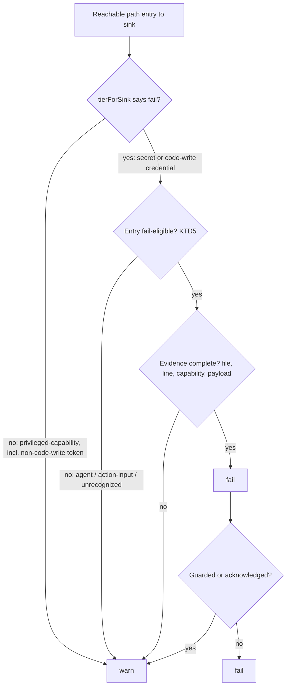

# Precision Core - Plan

## Goal Capsule

- **Objective:** Make every Blastgate `fail` a proven exploit. For untrusted-text findings, that means classifying where attacker text lands and failing only on a real sink, with the proof attached to the finding.
- **Product authority:** `STRATEGY.md` (Precision core track; metric "Fail-tier precision") → this plan's Product Contract → Planning Contract. Agent-in-CI modeling (Track 2) and Public evidence (Track 3) are separate tracks and not active scope here.
- **Execution profile:** TDD per repo `CLAUDE.md` §2 — the failing test for each unit is written and reviewed before the code. One commit per unit on a feature branch; merge to `main` is human-only.
- **Stop conditions:** Stop and ask if a change would alter a Product Contract rule, if the 50-repo re-scan (U7) shows a lost high-confidence finding, or before creating any GitHub repository.
- **Open blockers:** None.
- **Product Contract preservation:** changed R10 — JSON output carries payloads only behind an explicit flag (user-approved at plan scoping), and run records are listed as a payload-free surface; R12 no longer assumes the four artifact-injection findings stay fail (the 2026-09-29 re-scan showed all four were false positives; user-approved, see U10); R2 clarified to include inline scripts (KTD2), no scope change; R11 changed to fixture proof instead of live sandbox reproductions (user-directed, KTD7); otherwise unchanged.

---

## Product Contract

### Summary

A `fail` gets a strict contract: attacker-controlled input can run unintended code in a privileged context that reaches a secret or code-write capability, and the finding shows the line, the capability, and an example payload.
Each untrusted-text use is classified by sink type, and the tier follows from the sink and the capability; anything short of the contract becomes a warn.
Each sink class that can fail is proven by a committed fixture pair.

### Problem Frame

After 0044, the 50-repo scan still produces 27 fail-tier findings. Four are high-confidence `workflow_run` artifact splices. The other 23 are co-presence findings: untrusted issue/PR text reaches a job that also holds a secret.
Their precision has not been measured since 0044; the pre-0044 hand review of 8 jobs found most co-presence fails were review-worthy, not exploitable.
The detector does not distinguish text interpolated into a shell from text passed safely through `env:`, handed to a third-party action, or fed to an agent. It also treats any `GITHUB_TOKEN` write scope as a credential sink.
`STRATEGY.md` promises that a failure is always worth acting on. A security reviewer who opens one false `fail` stops trusting the rest.

### Key Decisions

- **Fail requires a proven sink, not co-presence.** Co-presence drops to warn. Governs R1, R4. (session-settled: user-approved — chosen over "keep fail, add confidence" and "drop co-presence entirely": keeps review-worthy jobs visible without diluting fail.)
- **The user's bar defines the contract: "clearly see an exploit risk of executing code that is unwanted or changing code in a repo without authorization."** Governs R1, R2, R3.
- **Agent ingestion is warn until Track 2 can show the agent reaches a secret plus an exfil channel.** Governs R5. (session-settled: user-approved — chosen over "fail now" and "fail if agent has tools": keeps fail strictly proven; the agent story lands with Track 2.)
- **Third-party action inputs are warn.** Governs R5. (session-settled: user-approved — chosen over "fail on a known-bad list" and "fail": Blastgate cannot see action internals offline.)
- **Non-code write scopes are warn.** Governs R3. (session-settled: user-approved — chosen over "fail": comment/label abuse is real but is not repo-code compromise.)
- **Shell sinks count against the whole job's capabilities, not only the step's.** In-job code execution can read every secret the job holds, as the tj-actions runner-memory dump showed. Governs R2.
- **Sink classification plus an evidence contract; multi-hop taint deferred.** (session-settled: user-approved — chosen over "classification only" and "classification + taint flow": a fail that cannot state its proof demotes itself, and it extends the 0044 detectors.) Governs R4, R8.
- **Payloads stay out of public surfaces.** Governs R10.

### Requirements

**Fail contract**

- R1. A finding is `fail` only when attacker-controlled input reaches an execution sink in a privileged context (a secret-bearing or write-token job reachable by an untrusted trigger) and that context holds a secret or a code-write capability; every other reachable path is at most `warn`.
- R2. An execution sink is untrusted text interpolated into a shell command or inline script, or an untrusted artifact's contents spliced into a shell (the existing 0042 shape); an execution sink in any step reaches every capability held by its job.
- R3. Code-write capability means a token or credential that can change repo contents or workflows (for example `contents: write`, `workflows: write`, or a push-capable secret); PR, issue, comment, and label write scopes alone are not code-write.

**Sink classification**

- R4. Each untrusted-text use in a job is classified into exactly one sink class: shell-interpolated, env-passed, boolean-compared, action-input, agent-ingested, or unrecognized.
- R5. Only shell-interpolated uses can produce `fail`; action-input, agent-ingested, and unrecognized uses produce `warn` when the job holds a secret or write token; env-passed and boolean-compared uses produce no finding.
- R6. The existing guard exemptions (actor guard, label gate, script permission guard) continue to suppress untrusted-text findings.

**Evidence**

- R7. Every `fail` finding carries its proof: the file and line where attacker input lands in the sink, the capability reached (named secret or code-write scope), and an illustrative payload for that sink class.
- R8. A path that meets R1 but cannot produce all R7 evidence is reported as `warn`, not `fail`.
- R9. Every fail-producing entry class (untrusted-text shell sink, `workflow_run` artifact splice, and fork-PR install script) meets R1 and R7; classes outside untrusted text get evidence added, not a redesign.
- R10. Illustrative payloads appear only in local CLI text output, and in JSON output when explicitly requested; the markdown report, the GitHub Action job summary and annotations, the MCP tool, and `--record` run records show the line and capability without the payload.

**Proof of precision**

- R11. Each sink class that can produce `fail` is demonstrated by a committed positive/negative fixture pair whose scan shows the fail with complete evidence; no live exploitation is performed.
- R12. The 50-repo scan is re-run after the change, and every remaining `fail` is hand-verified against source as meeting R1; each of the four 2026-08-06 `workflow_run` artifact-injection findings is re-adjudicated by hand and its outcome recorded.

### Acceptance Examples

- AE1. **Covers R2, R5, R7.** **Given** an `issues` job whose `run:` step contains `echo "${{ github.event.issue.title }}"` and whose later step uses `secrets.DEPLOY_KEY`, **when** scanned, **then** the finding is `fail`, cites the `run:` line, names `DEPLOY_KEY`, and in CLI output includes an example title payload.
- AE2. **Covers R4, R5.** **Given** the same job passing the title via `env: TITLE: ${{ github.event.issue.title }}` and using `"$TITLE"` in the script, **then** no untrusted-text finding is produced.
- AE3. **Covers R3.** **Given** a `pull_request_target` job that shell-interpolates the PR title and holds only `pull-requests: write`, **then** the finding is `warn`, not `fail`.
- AE4. **Covers R5.** **Given** an `issue_comment` job that runs a coding-agent action and holds `ANTHROPIC_API_KEY`, **then** the finding is `warn` with a reason naming agent ingestion.
- AE5. **Covers R5.** **Given** an `issues` job passing the issue title into a third-party notify action's `with:` input while holding a webhook secret, **then** the finding is `warn`.
- AE6. **Covers R10.** **Given** AE1 run through the GitHub Action, **then** the job summary shows the line and `DEPLOY_KEY` but no payload.

### Scope Boundaries

**Deferred for later**

- Multi-hop taint through `$GITHUB_OUTPUT`, step outputs, and job outputs; such cases stay `warn` or unreported until the benchmark shows they matter.
- Agent Rule-of-Two modeling that can promote agent ingestion to `fail` (Track 2).
- The labeled benchmark and precision/recall comparison against zizmor (Track 3).
- A curated list of third-party actions known to shell-splice their inputs.

**Outside this work**

- New ecosystems, CI providers, or entry kinds.
- Runtime or LLM-based detection.

### Dependencies / Assumptions

- The 27 / 4 / 23 finding counts come from the 0044 re-scan recorded in `docs/implementation-notes.md`; the co-presence subclass has not been hand-verified since.
- The 50-repo re-scan (R12) only reads public repositories; nothing outside this repo is written.
- Blastgate is unpublished (0.1.0, not on npm), so demoting fails to warns breaks no external CI.

### Outstanding Questions

- Interpolation shapes that count as an execution sink: resolved in KTD2.
- How fail classes are proven: resolved in KTD7 (committed fixtures).
- Whether a guarded path that otherwise meets R1 should `warn` rather than be suppressed (fork-PR parity, raised in 0044): deferred; guards keep suppressing, per R6.

### Sources / Research

- `src/analyzers/ci/injection.ts` — current untrusted-text detectors and 0044 neutralizers.
- `src/analyzers/ci/index.ts` — where untrusted-text entries are emitted.
- `src/findings/finding.ts` — `tierForSink` makes every secret/credential sink `fail` today.
- `src/action/index.ts` — the Action writes the markdown report to the job summary.
- `docs/evaluations/2026-08-06-top25-empirical-scan.md` §3–§4 — the co-presence class and the 8-job precision review.
- `docs/implementation-notes.md` — 0041, 0042, 0044 entries and the post-0044 re-scan counts.
- Microsoft Security Blog, "Securing CI/CD in an agentic world" (2026-06-05) — the Agents Rule of Two.

---

## Planning Contract

### Key Technical Decisions

- KTD1. **Classify sinks per job in the CI analyzer, not in the engine.** `src/analyzers/ci/injection.ts` gains a classifier that returns, for a job, its strongest untrusted-text sink class plus evidence (step index, field). Precedence is execution > agent-ingested > action-input > unrecognized; env-passed and boolean-compared produce nothing. The analyzer already owns the 0041/0042/0044 detectors, so the new logic sits beside them. Governs R4, R5.
- KTD2. **An execution sink is an untrusted `${{ github.event.*.body|title }}` expression inside a `run:` script or an `actions/github-script` `script:` input.** Both expand before execution, so attacker text becomes shell or JavaScript code in a privileged job. The 0042 artifact splice stays an execution sink. Any other `with:` input of a third-party action is action-input. Governs R2, R4.
- KTD3. **Line evidence comes from `yaml`'s `parseDocument` with a `LineCounter`, not text search.** A text search for the expression can match the wrong job when two jobs share a step. Verified: `yaml` 2.9.0 reports `{ line: 12 }` for the `run:` in `test/fixtures/ci-artifact-injection/positive/.github/workflows/comment.yml`. The plain `parseWorkflow` stays for the object model. A new locator maps (job, step index, field) → line. Governs R7.
- KTD4. **Only a code-write GITHUB_TOKEN is a credential sink.** `resolvePermissions` adds `codeWrite` (`contents: write` or `write-all`). An over-broad token without code-write is emitted as a `privileged-capability` sink, which `tierForSink` already maps to warn. This reuses the existing tier rule instead of adding a flag to sinks. Governs R3.
- KTD5. **The tier moves from sink kind alone to a path-level contract check in `src/engine/checks.ts`.** A path is fail only when `tierForSink` says fail, the entry is fail-eligible, and the evidence is complete. Fail-eligible means: an untrusted-text entry with an execution sink class, a fork-PR entry whose job runs a step after the untrusted checkout, or a new dependency running in a fork-triggerable job. A checkout that nothing executes is not proven execution. Incomplete evidence demotes to warn. Acknowledgement and guard downgrades still apply after this check. Governs R1, R5, R8.
- KTD6. **Evidence is a new optional `evidence` field on `Finding`: file, line, capability, and payload.** The payload is a fixed illustrative string per sink class, never derived from repo content, so it cannot echo secrets. Renderers choose whether to print it. Governs R7, R10.
- KTD7. **Fail classes are proven by committed fixtures, not live exploitation.** The e2e suite already requires complete evidence on every positive fixture's fail (U6). (session-settled: user-directed — chosen over live sandbox reproductions on throwaway repos: the fixtures prove the contract locally without producing exploit material.) Governs R11.
- KTD9. **An artifact splice is a sink only when an unquoted command substitution reads a file in command-word or argument position.** An assignment (`X=$(cat f)`, including `export`/`local`) neither executes nor word-splits the value, and a substitution inside double quotes cannot add arguments. A quote-aware scan of the whole `run:` script replaces the line regex. Accepted false negative: a quoted `"$(<f)"` used as a whole argument can still inject a leading `--flag`. Governs R2. (session-settled: user-approved — chosen over "demote the class to warn" and "document as-is": keeps fail possible for a genuine splice while removing the assignment false positives.)
- KTD8. **The 50-repo scan becomes a committed script plus a repo list.** It reuses the blobless sparse-clone method from the 2026-08-06 evaluation, so the R12 re-scan and Track 3 run the same way. Governs R12.

### High-Level Technical Design

How a path gets its tier after this change:

Untrusted-text sink classes and their outcomes (R4, R5):

| Sink class | Example | Job holds secret or code-write | Job holds only other write scope |
|---|---|---|---|
| execution | `run: echo "${{ github.event.issue.title }}"` | fail | warn |
| agent-ingested | `uses: anthropics/claude-code-action` | warn | warn |
| action-input | `with: { text: ${{ github.event.issue.title }} }` | warn | warn |
| unrecognized | untrusted ref in an unclassified field | warn | warn |
| env-passed | `env: { TITLE: ${{ … }} }` + `"$TITLE"` | none | none |
| boolean-compared | `if: contains(github.event.comment.body, '/go')` | none | none |

### Sequencing

U1 and U3 are independent foundations. U2 needs U1. U4 needs U2 and U3. U5 and U6 need U4. U10 needs U4 and was added after the first re-scan. U7 needs U6 and U10. U8 needs U6. U9 closes out.

---

## Implementation Units

### U1. Workflow source locator

**Goal:** Map a job, step index, and field in a GitHub workflow to its 1-based source line.

**Requirements:** R7 (via KTD3)

**Dependencies:** None

**Files:**
- `src/analyzers/ci/locate.ts` (new)
- `src/analyzers/ci/locate.test.ts` (new)

**Approach:**
- Parse with `parseDocument` and a `LineCounter` once per file, and expose a generic key-path → line lookup. Add a GitHub convenience keyed by job id, step index, and field (`run`, `with.script`, `with.<key>`, `uses`, step start). GitLab uses the generic lookup for a job's definition line.
- Return `undefined` rather than throwing when a node is missing, so evidence can be incomplete (R8) instead of crashing the run.
- Mirror `parseWorkflow`'s error contract: invalid YAML is already reported by the analyzer.

**Patterns to follow:** `src/analyzers/ci/parse.ts` small exported pure functions with co-located `*.test.ts`.

**Test scenarios:**
- A `run:` in the second step of the second job returns the line of that `run:` key's value.
- Two jobs with identical step text return different lines.
- Block scalar (`run: |`) returns the first content line's parent key line.
- A missing job, step index, or field returns `undefined`.
- Flow-style `with: { script: … }` returns a line.
- Generic lookup of a top-level GitLab job key in a `.gitlab-ci.yml` returns its line.

**Verification:** The locator returns line 12 for the `run:` in the artifact-injection positive fixture.

### U2. Untrusted-text sink classification

**Goal:** Replace the co-presence untrusted-text entry with a classified entry carrying its sink class and evidence location.

**Requirements:** R2, R4, R5, R6 (via KTD1, KTD2)

**Dependencies:** U1

**Files:**
- `src/analyzers/ci/injection.ts`
- `src/analyzers/ci/index.ts`
- `src/graph/types.ts`
- `src/analyzers/ci/injection.test.ts`
- `src/analyzers/ci/ci.test.ts`

**Approach:**
1. Add a classifier over a job's steps that tags each untrusted-text use per the KTD2 table and returns the strongest class plus its step index and field.
2. The existing `workflowRunArtifactInjection` result maps to the execution class, with the evidence at the splicing `run:` step.
3. Extend `EntryNode` with optional `sinkClass` and `evidence` (file and line from U1).
4. In `src/analyzers/ci/index.ts`, emit the untrusted-text entry only when the class is not env-passed or boolean-compared, and keep `injectionNeutralized` suppression (R6).
5. `textOnlyBooleanMatched` becomes the boolean-compared class rather than a separate neutralizer.

**Execution note:** Implement test-first; each sink class gets its RED test before the classifier handles it.

**Patterns to follow:** `injectableTextRefs`, `BOOLEAN_GUARD_CALL`, and `AGENT_ACTION_RE` in `src/analyzers/ci/injection.ts`.

**Test scenarios:**
- `run:` interpolating `github.event.issue.title` → execution class, evidence at that step.
- `actions/github-script` `script:` interpolating `github.event.comment.body` → execution class.
- Title passed via step `env:` and used as `"$TITLE"` → no entry.
- Body used only inside `contains(...)` in `if:` → no entry.
- `anthropics/claude-code-action` with the body in `prompt:` → agent-ingested.
- Title in a third-party action's `with:` → action-input.
- A job with both an agent step and a `run:` interpolation → execution (strongest wins).
- Actor-guarded job with a `run:` interpolation → no entry (R6).
- `workflow_run` job splicing `$(<file)` from a downloaded artifact → execution, evidence at the splice.
- Plain `pull_request` trigger → no entry (unchanged credential-reachability rule).

**Verification:** The existing injection and artifact tests pass, with expectations updated only where the class change is intended.

### U3. Code-write token capability

**Goal:** Distinguish a code-write GITHUB_TOKEN from other write scopes.

**Requirements:** R3 (via KTD4)

**Dependencies:** None

**Files:**
- `src/analyzers/ci/parse.ts`
- `src/analyzers/ci/index.ts`
- `src/analyzers/ci/ci.test.ts`

**Approach:** Add `codeWrite` to `TokenPermissions`. In the analyzer, an over-broad token with `codeWrite` stays a `credential` sink; an over-broad token without it becomes a `privileged-capability` sink with an identity naming its scopes. Inherited or unknown permissions stay non-sinks, as today.

**Patterns to follow:** `resolvePermissions` in `src/analyzers/ci/parse.ts`.

**Test scenarios:**
- `contents: write` → codeWrite, credential sink.
- `write-all` → codeWrite, credential sink.
- `pull-requests: write, issues: write` → not codeWrite, privileged-capability sink.
- `read-all` and absent permissions → no token sink.
- Job-level permissions override workflow-level for codeWrite.

**Verification:** A fork-PR job with only `pull-requests: write` now yields a warn-tier finding in engine tests.

### U4. Fail contract and evidence in findings

**Goal:** Compute tier from the path-level contract and attach evidence to every fail-eligible finding.

**Requirements:** R1, R5, R7, R8, R9 (via KTD5, KTD6)

**Dependencies:** U2, U3

**Files:**
- `src/findings/finding.ts`
- `src/engine/checks.ts`
- `src/graph/types.ts`
- `src/analyzers/ci/index.ts`
- `src/analyzers/gitlabci/index.ts`
- `src/engine/engine.test.ts`

**Approach:**
1. Add the optional `evidence` field to `Finding` per KTD6.
2. Add a fixed illustrative payload per fail-eligible class: execution (a crafted issue title that breaks out of the shell string), fork-PR (a modified build script in the PR), install script (a `preinstall` that exfiltrates env).
3. Give `CiJobNode` optional evidence lines for the first executing step (`run:` or action) after its untrusted checkout, and for its install step (from `hasInstallStep`), located via U1. GitLab jobs record the job definition line.
4. Replace the `toFinding` tier expression with the KTD5 contract check, keeping the guarded-fork-PR and acknowledgement downgrades after it.
5. Update `describe()` reasons for agent-ingested and action-input untrusted-text paths so the warn explains what is unproven.

**Execution note:** Start with failing engine tests for AE1–AE5 before touching `toFinding`.

**Patterns to follow:** `isGuardedForkPr` and `describe()` in `src/engine/checks.ts`; optional-field style of `acknowledged` and `advisories` on `Finding`.

**Test scenarios:**
- Covers AE1. Execution sink in step 1, `DEPLOY_KEY` used in step 2 → fail with evidence line, capability `DEPLOY_KEY`, and a payload.
- Covers AE3. Execution sink with only `pull-requests: write` → warn.
- Covers AE4. Agent-ingested with `ANTHROPIC_API_KEY` → warn, reason names agent ingestion.
- Covers AE5. Action-input with a webhook secret → warn.
- Fail-eligible path whose evidence line cannot be located → warn (R8).
- Fork-PR job with an untrusted checkout followed by `npm test` and holding `AWS_SECRET_ACCESS_KEY` → fail with evidence at the `npm test` step.
- Fork-PR job whose untrusted checkout is its last step → warn (no proven execution).
- New dependency with an install script in a fork-triggerable job → fail with evidence at the install step.
- GitLab MR-triggerable job holding a secret → fail with evidence at the job definition.
- Acknowledged fail-eligible finding → warn, evidence still present.
- Actor-guarded fork-PR → warn (existing U17 behavior preserved).

**Verification:** `npm test` passes; no finding has `tier: 'fail'` without a complete `evidence` field in any engine test.

### U5. Evidence rendering and payload surfaces

**Goal:** Show evidence on every surface, and show payloads only where R10 allows.

**Requirements:** R7, R10

**Dependencies:** U4

**Files:**
- `src/cli/render.ts`
- `src/cli/index.ts`
- `src/mcp/tools.ts`
- `src/report/run-record.ts`
- `src/cli/cli.test.ts`
- `src/report/report.test.ts`
- `test/action.parity.test.ts`

**Approach:**
1. `renderText` prints `file:line`, capability, and payload under each finding.
2. `renderMarkdown` prints `file:line` and capability, never the payload.
3. `renderJson` strips `evidence.payload` unless a new `--include-payloads` flag is passed.
4. The MCP tool output and `--record` run-record files strip the payload (records are written to disk and may be uploaded or committed).
5. The Action already uses `renderMarkdown` for the summary and `reason` for annotations, so no payload reaches it; the parity test proves this.

**Patterns to follow:** existing flag handling (`--provenance`, `--advisories`) in `src/cli/index.ts`; `markdownFinding` in `src/cli/render.ts`.

**Test scenarios:**
- Text output for a fail finding contains the file, line, capability, and payload.
- Markdown output for the same finding contains file and line but not the payload string.
- JSON output omits `payload` by default and includes it with `--include-payloads`.
- Covers AE6. Action run over the shell-injection fixture: summary and annotations contain `DEPLOY_KEY` and the line, and no payload string.
- MCP tool result for a fail finding has no payload.
- A `--record` run record for a fail finding keeps the evidence line but has no payload.

**Verification:** A grep of the Action parity test's captured summary for the payload marker finds nothing.

### U6. Fixtures and end-to-end coverage

**Goal:** Encode the new contract in the fixture-pair e2e suite.

**Requirements:** R1, R5, R9

**Dependencies:** U4

**Files:**
- `test/fixtures/untrusted-text-shell/positive/.github/workflows/triage.yml` (new)
- `test/fixtures/untrusted-text-shell/negative/.github/workflows/triage.yml` (new)
- `test/fixtures/untrusted-text-injection/` (existing; expected verdict changes)
- `test/engine.e2e.test.ts`

**Approach:** Add an `untrusted-text-shell` check whose positive fixture is AE1 and whose negative fixture is AE2 (env-passed). Change the existing `untrusted-text-injection` check (claude-code-action reading a comment) to expect warn. Every positive fixture expecting fail also asserts complete evidence.

**Patterns to follow:** the check table and fixture-pair coverage test in `test/engine.e2e.test.ts`.

**Test scenarios:**
- `untrusted-text-shell` positive → fail with evidence; negative → pass.
- `untrusted-text-injection` positive → warn; negative → pass.
- `ci-artifact-injection`, `fork-pr-secret`, `install-script-secret`, `gitlab-fork-secret` positives remain fail and now carry evidence.
- The coverage test still requires a positive and negative fixture per declared check.

**Verification:** `npm test` passes, with the fixture-coverage test green.

### U7. Reproducible scan harness and re-scan

**Goal:** Re-run the 50-repo scan against the new contract and hand-verify every remaining fail.

**Requirements:** R12 (via KTD8)

**Dependencies:** U6

**Files:**
- `scripts/eval-scan.sh` (new)
- `scripts/eval-repos.txt` (new)
- `docs/evaluations/2026-09-29-precision-core-rescan.md` (new)

**Approach:**
1. Commit the 50 repos from the 2026-08-06 evaluation as a list.
2. The script sparse-clones each into a scratch directory (the same paths as before), runs `blastgate <dir> --json`, and writes a verdict table.
3. Run it, then hand-verify each fail against source per R1, and record per-finding verdicts in the new evaluation doc.

**Execution note:** This is a measurement unit; verification is the recorded hand review, not unit tests.

**Test expectation:** none — a read-only evaluation script; its output is reviewed by hand.

**Verification:**
- Every fail in the re-scan is marked exploitable in the evaluation doc.
- The four `workflow_run` artifact-injection findings (pytorch ×2, grafana, free-programming-books) are still fail.
- Any finding that moved from fail to warn is listed with its sink class.

### U8. Fixture proof per fail class

**Goal:** Show each fail-producing sink class with a committed fixture pair.

**Requirements:** R11 (via KTD7)

**Dependencies:** U6

**Files:** none beyond U6. The classes map to existing fixtures: `untrusted-text-shell`, `ci-artifact-injection`, `fork-pr-secret`, `install-script-secret`, `gitlab-fork-secret`.

**Test expectation:** none — covered by U6's evidence assertion over every positive fixture.

**Verification:** `npm test` passes with the e2e evidence assertion in `test/engine.e2e.test.ts`.

### U10. Artifact-splice precision

**Goal:** Stop flagging validated variable assignments as artifact-injection sinks.

**Requirements:** R2, R12 (via KTD9)

**Dependencies:** U4

**Files:**
- `src/analyzers/ci/injection.ts`
- `src/analyzers/ci/injection.test.ts`
- `src/analyzers/ci/ci.test.ts`

**Approach:** Replace `FILE_INTO_SHELL_RE`'s line match in `readsFileIntoShell` and `artifactSpliceStep` with a scan that tracks double quotes, single quotes, and backslash escapes across the whole script. It counts a `$(<f)` / `$(cat f)` only when it is unquoted and not the right-hand side of an assignment.

**Execution note:** Test-first. The four re-scan false positives (pytorch ×3, grafana) are the RED cases.

**Patterns to follow:** `workflowRunArtifactInjection` and its 0042 tests in `src/analyzers/ci/ci.test.ts`.

**Test scenarios:**
- `gh pr comment $(<PRurl)` → sink (free-programming-books shape).
- `then gh pr edit $(cat f)` and `a && gh x $(<f)` → sink.
- `PR_NUMBER=$(cat /tmp/pr-number/pr-number.txt)` → not a sink (grafana).
- `export X=$(<f)` and `local X=$(cat f)` → not a sink.
- `echo "body $(cat f)"`, including a multi-line double-quoted string → not a sink.
- `HASH=$(cat a \` with a line continuation → not a sink (pytorch hardened-pr-review).
- The `ci-artifact-injection` positive fixture still fails.

**Verification:** Re-scan: pytorch and grafana have no fails; free-programming-books remains a warn.

### U9. Contract documentation

**Goal:** Make the README, threat model, and notes state the new meaning of fail.

**Requirements:** R1, R10

**Dependencies:** U7

**Files:**
- `README.md`
- `docs/threat-model.md`
- `docs/implementation-notes.md`

**Approach:** Replace "fails on a reachable secret path" wording with the R1 contract. Document the sink-class table and the payload surfaces. Add a dated implementation-notes entry covering the deviations recorded during U1–U8.

**Test expectation:** none — documentation only.

**Verification:** No README or threat-model sentence claims a fail on co-presence or on agent ingestion.

---

## Verification Contract

| Gate | Command | Applies to |
|---|---|---|
| Format | `npm run format:check` | all code units |
| Types | `npm run typecheck` | all code units |
| Lint | `npm run lint` | all code units |
| Build | `npm run build` | U4, U5 (dist is what the Action and plugin run) |
| Tests | `npm test` | U1–U6 |
| Re-scan | `scripts/eval-scan.sh` plus hand review | U7 |

These mirror `.github/workflows/ci.yml`.

---

## Definition of Done

- Every AE1–AE6 has a passing test that cites it.
- In every test and in the U7 re-scan, no `fail` finding lacks complete evidence.
- The U7 evaluation doc records a hand verdict for every fail, all exploitable, with the four artifact-injection findings retained.
- Each fail class has a committed fixture pair whose positive fails with complete evidence (U6/U8).
- README and threat model describe the R1 contract.
- All gates in the Verification Contract pass.
- No abandoned-approach code remains in the diff.
