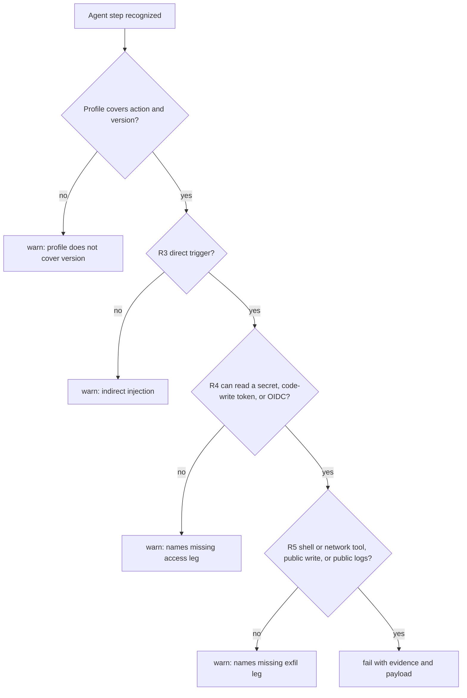

# Agent-in-CI Model - Plan

## Goal Capsule

- **Objective:** Decide when an AI agent running in CI is a proven exploit. Blastgate judges each agent step against the Agents Rule of Two (untrusted input, sensitive access, an exfiltration channel), fails only when all three hold in readable configuration, and warns otherwise.
- **Product authority:** `STRATEGY.md` (Agent-in-CI modeling track) → this Product Contract. The fail contract in `docs/plans/2026-09-29-001-feat-precision-core-plan.md` (R1, R7–R10) still governs every fail. The crawler, the OpenSSF Scorecard contribution, and other checks are not active scope.
- **Execution profile:** TDD per repo `CLAUDE.md` §2: the failing test for each unit is written first. One commit per unit on a feature branch; merge to `main` is human-only, and a PR is not merged before its review completes.
- **Stop conditions:** Stop and ask if a vendor's current docs contradict a profile default this plan relies on, if the re-scan (U7) produces a fail that hand review cannot confirm, or before any outbound action beyond read-only GitHub API calls.
- **Open blockers:** None.
- **Product Contract preservation:** R3 clarified: codex-action's `allow-users`/`allow-bots` take explicit names only, so they do not open the agent to outsiders (verified against the action's docs, 2026-10-01). No scope change.

---

## Product Contract

### Summary

Blastgate recognizes the major coding-agent actions and tool-less LLM steps in GitHub workflows.
It judges each against a versioned, cited profile of that action's trigger gate and tool defaults.
An agent step fails only when an outsider can trigger it directly, it can read a secret or code-write credential, and it has a way to get that data out. Every other agent finding is a warn.

### Problem Frame

Precision Core made every untrusted-text-to-agent path a warn, because Blastgate could not tell whether an agent could actually be steered into leaking anything.
That left the attack class `STRATEGY.md` targets, AI agents in CI, unable to produce a fail. It also blocks the crawler, which would otherwise find nothing to disclose and could mislabel exposed agent repos as passes.
Today Blastgate recognizes `claude-code-action`-style actions by name only (`AGENT_ACTION_RE` in `src/analyzers/ci/injection.ts`). It does not recognize `run-gemini-cli`, `codex-action`, or `actions/ai-inference`, and it does not read any agent's trigger gate or tool configuration.
The 2026-09-29 re-scan found a missed case: home-assistant passes issue text through `env:` into a GitHub Models call, which is prompt injection but produced no finding.
Public incidents show that the risk depends on configuration. Comment and Control leaked keys through claude-code-action, Copilot, and Gemini CLI workflows. A run-gemini-cli advisory (CVSS 10) escalated a GitHub issue to GCP project compromise via an OIDC credential.

### Key Decisions

- **Direct triggering can fail; indirect content injection warns.** An outsider who can trigger the agent themselves is a proven path. An agent that reads outsider content only when a write-access user triggers it needs a maintainer action, so it warns. Governs R3, R7. (session-settled: user-approved — chosen over "both fail" and "score, don't gate": matches the bar of clearly seeing the exploit.)
- **Judge agents against per-action profiles, not generic inference.** Each recognized action has a versioned profile citing its own security docs or advisories. Assuming every agent has every tool would turn most agent repos into fails. Governs R2, R9. (session-settled: user-approved — chosen over capability-maximal inference: precise and citable, at the cost of maintaining the table.)
- **Tool-less LLM steps are in scope as warns.** `actions/ai-inference` and github-script calls to GitHub Models ingest untrusted text but cannot exfiltrate directly. Governs R8. (session-settled: user-approved.)
- **On a public repo, Actions logs count as an exfiltration channel.** An agent that can read a secret can print it in an encoded form that log masking misses, which is how Comment and Control leaked keys. Governs R5. (session-settled: user-approved.)
- **The crawler waits for this work.** Without an agent verdict, the crawler's target population (repos running agents in CI) would yield no disclosable fails and misleading passes. (session-settled: user-directed — chosen over "measure now, publish later" and "3-state public labels".)

### Requirements

**Recognition**

- R1. Blastgate recognizes as agent steps: `claude-code-action`, `codex-action`, `run-gemini-cli`, and tool-less LLM steps (`actions/ai-inference`; `actions/github-script` calling GitHub Models).
- R2. Each recognized action has a profile recording its default trigger gate, the inputs that bypass it, the inputs that grant tools, its tool defaults, and the version range the profile covers; every entry cites the action's own documentation or advisory.

**Rule of Two**

- R3. Untrusted input (direct) holds when an outsider can trigger the agent step itself: its trigger is attacker-reachable and the action's write-access gate is absent or opened to outsiders (for example claude-code-action's `allowed_non_write_users: '*'` or `allowed_bots: '*'`), with no recognized guard on the job.
- R4. Sensitive access holds when the agent has a tool able to read process environment or runner files while its job holds a named secret, a code-write `GITHUB_TOKEN`, or `id-token: write`. Credential rules are those of Precision Core R3 / 0047, and the agent's own model API key counts.
- R5. An exfiltration channel holds when the agent has a shell or network tool, can write to a public surface (comments, PRs, issues), or runs in a public repository whose Actions logs are publicly readable.

**Verdict**

- R6. An agent step is `fail` only when R3, R4, and R5 all hold from configuration Blastgate can read, and the finding carries Precision Core evidence (agent step `file:line`, the capability reached, a local-only payload).
- R7. An agent step that ingests outsider content but can only be triggered by write-access users is `warn` (indirect injection), as is any agent step where a Rule-of-Two leg is missing.
- R8. A tool-less LLM step that ingests untrusted text, including text passed through `env:`, is `warn` and never `fail`.
- R9. An agent step whose action version no profile covers, or whose tool or gate configuration Blastgate cannot read, is `warn` with a reason naming what is unknown.
- R10. Every agent warn names which Rule-of-Two legs hold and which are missing.

**Proof**

- R11. Labeled fixtures reproduce the public cases: a bypassed-gate claude-code-action with shell tools (the Comment and Control shape), the run-gemini-cli OIDC shape, and the PromptPwnd shape. Each must fail with evidence, and each hardened counterpart (gate intact, tools restricted, or secrets removed) must warn or pass.
- R12. The 50-repo sample stays free of unverified fails, and the home-assistant workflow becomes an agent-ingested warn.

### Acceptance Examples

- AE1. **Covers R3–R6.** **Given** an `issue_comment` workflow running `claude-code-action` with `allowed_non_write_users: "*"` and shell tools allowed, holding `ANTHROPIC_API_KEY`, **then** the finding is `fail` with evidence at the agent step.
- AE2. **Covers R7.** **Given** the same workflow without `allowed_non_write_users`, **then** the finding is `warn` naming indirect injection.
- AE3. **Covers R4, R10.** **Given** AE1 but with tools restricted to `Bash(gh issue view:*)`, **then** the finding is `warn` naming the missing sensitive-access leg.
- AE4. **Covers R8, R12.** **Given** an `issues` workflow passing the title and body via `env:` into github-script that calls GitHub Models, holding `issues: write`, **then** the finding is an agent-ingested `warn`.
- AE5. **Covers R9.** **Given** a recognized agent action pinned to a version outside every profile's range, **then** the finding is `warn` naming the uncovered version.

### Scope Boundaries

**Deferred for later**

- Multi-hop flows where an LLM's output is written to `$GITHUB_OUTPUT` and executed by a later step.
- Agents beyond the four recognized (aider, opencode, Copilot coding agent, custom harnesses); they stay on today's name match as warns.
- Runtime evidence from public Actions logs (which tools an agent actually used).

**Outside this work**

- The crawler, the public pass index, and private disclosure. These are the next brainstorm.
- The OpenSSF Scorecard Dangerous-Workflow contribution.

<!-- ce-section: work-relationships -->
### How This Work Fits Together

This plan owns the agent verdict. The broader breakdown is the current understanding, not a committed roadmap.

- **Crawler (next):** Depends on this plan. It scans repos running agents in CI and discloses fails privately; a fail-capable agent verdict is what gives it something to disclose.
- **Scorecard contribution:** Enables reach. It would upstream the simplest direct-trigger pattern from this plan into OpenSSF Scorecard's Dangerous-Workflow check. Still to decide when.
- **Static-serving secrets check:** Can proceed independently of this plan. It covers a secret file shipped in the deploy artifact (not excluded by `.gcloudignore`/`.dockerignore`, `COPY . .`) and served by a route over the project root; the 2026-05-30 `situation` incident is the motivating case.

### Dependencies / Assumptions

- Precision Core is merged (PRs #36, #37): the fail contract, evidence, and payload surfaces are reused unchanged.
- Agent action defaults change often. Each profile is only as current as its cited source, so profiles carry version ranges and an unknown version warns (R9).
- claude-code-action's `allowed_non_write_users` bypass applies only when `github_token` is passed, not with GitHub App authentication, per its security docs. Planning confirms the equivalent conditions for the other actions.

### Outstanding Questions

- Profile fields and defaults per action: resolved in KTD1–KTD4 and the profile table; U1 re-verifies at the pinned versions.
- `issues: opened` with an action's own gate: claude-code-action checks issue events (the opener needs write access); run-gemini-cli has no gate (KTD4); codex-action's gate cannot be opened to outsiders (KTD3).
- Which tool grants can read secrets: resolved in KTD2 (claude scrubbing), KTD4 (gemini OIDC), and U3's access rules.

### Sources / Research

- `src/analyzers/ci/injection.ts` — current `AGENT_ACTION_RE` and sink classification (`classifyUntrustedText`).
- `src/engine/checks.ts` — the fail contract (`tierFor`, `proof`, `evidenceFor`).
- `docs/evaluations/2026-09-29-precision-core-rescan.md` §5 — the home-assistant missed case.
- [claude-code-action security docs](https://github.com/anthropics/claude-code-action/blob/main/docs/security.md) — write-access gate, `allowed_non_write_users`, tool restriction.
- [Codex GitHub Action](https://learn.chatgpt.com/docs/github-action) — `allow-users`, `allow-bots` (explicit names, no wildcards), `safety-strategy`, `sandbox`.
- [run-gemini-cli README](https://github.com/google-github-actions/run-gemini-cli) — inputs, including `settings` and `gcp_workload_identity_provider`; no built-in actor check.
- [run-gemini-cli trust-model advisory GHSA-wpqr-6v78-jr5g](https://github.com/google-github-actions/run-gemini-cli/security/advisories/GHSA-wpqr-6v78-jr5g) and [Pillar Security's OIDC write-up](https://www.pillar.security/blog/a-wif-of-fresh-access-how-a-github-issue-on-gemini-cli-led-to-gcp-project-compromise).
- [CSA research note: Comment and Control](https://labs.cloudsecurityalliance.org/research/csa-research-note-ai-coding-agent-ci-prompt-injection-202608/) and [Aikido: PromptPwnd](https://www.aikido.dev/blog/promptpwnd-github-actions-ai-agents).
- GitHub code search, 2026-10-01: about 19.5k workflow files use `claude-code-action`, 1.3k `codex-action`, 1.2k `run-gemini-cli`, 800 `actions/ai-inference`.

---

## Planning Contract

### Key Technical Decisions

- KTD1. **Profiles live in one data module, keyed by action and version range.** Each profile records the trigger gate, the inputs that open it to outsiders, how tools are granted, the defaults, and a citation URL. Unknown versions fall through to R9. Governs R2, R9.
- KTD2. **claude-code-action: environment secrets count as reachable only when scrubbing is off.** With `allowed_non_write_users`, the action scrubs Anthropic, cloud, and Actions secrets from subprocess environments by default (`CLAUDE_CODE_SUBPROCESS_ENV_SCRUB`). Sensitive access then comes only from credentials on disk: the `GITHUB_TOKEN` that `actions/checkout` persists in `.git/config` unless `persist-credentials: false`, or a credentials file written by an auth action such as `google-github-actions/auth`. Setting the scrub variable to `0` restores environment secrets. Governs R4. (session-settled: user-approved — chosen over "any shell tool reaches every job secret": keeps fails demonstrable against the action's documented default.)
- KTD3. **codex-action is never directly triggerable from configuration.** Its bypass inputs take explicit account names, which the maintainer chose to trust. Its findings are indirect warns unless the job has some other unguarded outsider trigger. Governs R3, R7. (session-settled: user-approved.)
- KTD4. **run-gemini-cli has no trigger gate.** Any attacker-reachable trigger is direct unless the job carries a recognized guard (0017/0044 detectors). Tools come from the `settings` JSON input; `gcp_workload_identity_provider` counts as sensitive access (OIDC). Versions before 0.1.22 also ignore tool allowlists under `--yolo`. Governs R3, R4, R9.
- KTD5. **Repository visibility is an engine input, never a guess.** The Action reads `repository.private` from its event payload, the CLI takes `--public`, and the crawler supplies it. When unknown, public logs are not counted as an exfiltration channel, while shell and network tools still are. Governs R5. (session-settled: user-approved.)
- KTD6. **The verdict reuses Precision Core's seams.** The `agent-ingested` sink class keeps its name. An agent entry carries its assessment (which legs hold, what is unknown). `proof` in `src/engine/checks.ts` gives a payload only when all three legs hold, so `tierFor` fails it with no new tier logic. Governs R6, R7, R10.
- KTD7. **Tool-less LLM steps are recognized by what they call.** That means `uses: actions/ai-inference`, or an `actions/github-script` step whose script calls the GitHub Models endpoint. Untrusted text reaching them via `env:`, `with:`, or the script counts as ingestion. Governs R1, R8.
- KTD8. **The e2e negative for an agent is the same workflow on a `push` trigger.** An agent on an untrusted trigger always warns at least, so it can never be the harness's clean pass. Hardened counterparts are engine tests instead. Governs R11. (session-settled: user-approved.)

### High-Level Technical Design

How an agent step reaches a verdict:

Profile summary (verified 2026-10-01; implementation re-verifies at the pinned versions):

| Action | Trigger gate | Opens to outsiders | Tools granted by | Sensitive-access notes |
|---|---|---|---|---|
| claude-code-action | write access for issue, PR, comment, review, workflow_run | `allowed_non_write_users: '*'`, `allowed_bots: '*'` | `claude_args --allowedTools` | env scrub on by default when bypassed (KTD2) |
| codex-action | write access | none (names only) | `sandbox`, `safety-strategy` | `read-only` blocks network; `drop-sudo` default |
| run-gemini-cli | none | any untrusted trigger | `settings` JSON | OIDC via `gcp_workload_identity_provider`; < 0.1.22 ignores allowlists under `--yolo` |
| ai-inference / github-script → Models | n/a | n/a | none (tool-less) | warn only (R8) |

### Sequencing

U1 first. U2 and U4 depend on U1 and can proceed in parallel. U3 needs U2. U5 needs U3 and U4. U6 needs U5. U7 closes out.

---

## Implementation Units

### U1. Agent action profiles

**Goal:** A cited, versioned profile per recognized agent action.

**Requirements:** R2, R9 (via KTD1)

**Dependencies:** None

**Files:**
- `src/analyzers/ci/agents.ts` (new)
- `src/analyzers/ci/agents.test.ts` (new)

**Approach:**
1. Encode the four profiles from the table above, each with a version range and a citation URL.
2. Expose a lookup from a step's `uses:` (action plus ref) to its profile, or "unknown".
3. A SHA-pinned ref resolves only when the profile records it; otherwise it is unknown (R9).

**Execution note:** Before encoding, re-read each action's security docs at the versions being pinned. Stop if a default differs from this plan.

**Patterns to follow:** constant tables plus pure lookup functions in `src/analyzers/ci/parse.ts`.

**Test scenarios:**
- `anthropics/claude-code-action@v1` resolves to the claude profile.
- `google-github-actions/run-gemini-cli@v0.1.21` resolves with the pre-0.1.22 flag set.
- `openai/codex-action@v1` resolves to the codex profile.
- A version outside every range resolves to unknown.
- An unrecognized action resolves to undefined (not an agent).
- Every profile has a non-empty citation URL.

**Verification:** Each profile's defaults match the cited docs at review time.

### U2. Agent recognition, including tool-less LLM steps

**Goal:** Classify every recognized agent or LLM step as `agent-ingested` when it can ingest untrusted text.

**Requirements:** R1, R8 (via KTD7)

**Dependencies:** U1

**Files:**
- `src/analyzers/ci/injection.ts`
- `src/analyzers/ci/injection.test.ts`

**Approach:**
1. Replace the name-only `AGENT_ACTION_RE` match with U1's profile lookup, plus the tool-less LLM detection from KTD7.
2. A tool-less LLM step counts as ingesting when untrusted text reaches it through `env:` (step or job), `with:`, or its script.
3. Unrecognized agent names on today's regex (aider, opencode) stay `agent-ingested` with an "unknown agent" reason.

**Execution note:** Test-first. The home-assistant shape (AE4) is the first RED case.

**Patterns to follow:** `classifyStep` / `classifyUntrustedText` and `interpolatesUntrustedText` in `src/analyzers/ci/injection.ts`.

**Test scenarios:**
- Covers AE4. An `issues` job passes the title and body via `env:` into github-script that calls GitHub Models → `agent-ingested`.
- `actions/ai-inference` with `prompt: ${{ github.event.issue.body }}` → `agent-ingested`.
- github-script that reads env but calls no model → no agent classification (falls back to the existing env-passed rule).
- `google-github-actions/run-gemini-cli` on an `issue_comment` job → `agent-ingested`.
- `openai/codex-action` → `agent-ingested`.
- An execution sink plus an agent step in one job → execution still wins.

**Verification:** The existing 0046 classification tests stay green.

### U3. Rule-of-Two assessment

**Goal:** For each agent step, decide which of R3, R4, and R5 hold, and what is unknown.

**Requirements:** R3, R4, R5, R9, R10 (via KTD2, KTD3, KTD4)

**Dependencies:** U2

**Files:**
- `src/analyzers/ci/agents.ts`
- `src/analyzers/ci/agents.test.ts`

**Approach:**
1. **Direct (R3):** the job's trigger is attacker-reachable, the profile's gate is absent or opened to outsiders by its inputs, and no recognized job guard applies.
2. **Access (R4):** the job holds a named secret, a code-write or OIDC token (0047 rules), or an on-disk credential. Apply KTD2 for claude-code-action. Count the checkout-persisted token when the job checks out with `persist-credentials` not set to `false`, and count auth-action credential files.
3. **Exfil (R5):** the granted tools include shell or network access, the token can write a public surface, or visibility is public (U4).
4. Record which legs hold and an "unknown" reason when tool grants or inputs cannot be read (non-literal expressions, an unparseable `settings` JSON).

**Execution note:** Test-first, one leg at a time.

**Patterns to follow:** `resolvePermissions` (`codeWrite`, `mintsCredentials`), `findSecretRefs`, `hasActorGuard` in `src/analyzers/ci/parse.ts`.

**Test scenarios:**
- Covers AE1. Claude with `allowed_non_write_users: '*'`, `--allowedTools Bash`, scrub disabled, and `ANTHROPIC_API_KEY` → all three legs.
- Claude, the same, scrub default, and checkout persisting the token with `contents: write` → access holds via `.git/config`.
- Claude, the same, scrub default, no persisted token, no credential files → access missing.
- Covers AE2. Claude without the bypass → direct missing.
- Covers AE3. Claude with tools `Bash(gh issue view:*)` only → access missing.
- `allowed_bots: '*'` on an `issue_comment` job → direct holds.
- Codex with `allow-users: someone` → direct missing (KTD3).
- Gemini on `issues` with no guard and `gcp_workload_identity_provider` set → direct and access hold.
- Gemini with an `author_association` actor guard → direct missing.
- `claude_args` built from a non-literal expression → unknown reason recorded.
- Visibility public, the agent can read a secret, but no shell or network tool → exfil holds via logs; unknown visibility → exfil missing.

**Verification:** Every assessment names each leg as held, missing, or unknown.

### U4. Repository visibility input

**Goal:** Supply repository visibility to the engine from each surface.

**Requirements:** R5 (via KTD5)

**Dependencies:** U1

**Files:**
- `src/engine/build.ts`
- `src/action/index.ts`
- `src/cli/index.ts`
- `src/cli/cli.test.ts`
- `test/action.parity.test.ts`

**Approach:** Add an optional visibility field (`public` | `private` | `unknown`) to the engine inputs. The Action derives it from the event payload's `repository.private`; the CLI sets `public` with `--public`. The default is `unknown`.

**Patterns to follow:** existing optional engine inputs (`acknowledged`, `provenance`) and the flag handling in `src/cli/index.ts`.

**Test scenarios:**
- The Action with an event payload where `repository.private` is false passes `public`.
- The Action with no event payload passes `unknown`.
- The CLI with `--public` passes `public`; without it, `unknown`.

**Verification:** The help text lists `--public`.

### U5. Agent verdict, evidence, and reasons

**Goal:** Fail agent paths whose three legs hold; warn the rest with reasons naming the legs.

**Requirements:** R6, R7, R9, R10 (via KTD6)

**Dependencies:** U3, U4

**Files:**
- `src/graph/types.ts`
- `src/analyzers/ci/index.ts`
- `src/engine/checks.ts`
- `src/engine/contract.test.ts`

**Approach:**
1. Attach U3's assessment to the untrusted-text entry for agent steps.
2. In `proof`, return the agent step's evidence and a fixed agent payload only when all three legs hold.
3. In `describe`, the agent reason names each leg as held, missing, or unknown, and the uncovered version for R9.
4. The payload is a fixed illustration (a comment instructing the agent to print its credentials in an encoded form into its reply), shown only on local text output per Precision Core R10.

**Patterns to follow:** `proof` / `evidenceFor` / `tierFor` and the existing `agent-ingested` reason in `src/engine/checks.ts`.

**Test scenarios:**
- Covers AE1. Engine run → fail with evidence at the agent step and a payload.
- Covers AE2. → warn whose reason names indirect injection.
- Covers AE3. → warn whose reason names the missing access leg.
- Covers AE5. A pinned version outside every profile → warn naming the version.
- A failing agent finding's payload never appears in markdown, JSON (default), MCP, or run-record output (reuse the 0049 surface tests).
- An acknowledged agent fail → warn with evidence kept.

**Verification:** No agent finding fails without all three legs recorded as held.

### U6. Incident fixtures

**Goal:** Encode the public incident shapes as e2e fixture pairs.

**Requirements:** R11 (via KTD8)

**Dependencies:** U5

**Files:**
- `test/fixtures/agent-claude-bypass/` (new pair)
- `test/fixtures/agent-gemini-oidc/` (new pair)
- `test/fixtures/agent-promptpwnd/` (new pair)
- `test/engine.e2e.test.ts`

**Approach:**
- Each positive fixture reproduces one public shape and must fail with evidence. Each negative is the same workflow on `push`.
- `agent-claude-bypass` is the Comment and Control shape: bypass, shell, scrub off.
- `agent-gemini-oidc` is the advisory shape: issue trigger, no guard, OIDC.
- `agent-promptpwnd` puts an issue body in the prompt, with shell and a write token.
- Hardened variants live as U5 engine tests.

**Test scenarios:**
- Each positive → fail, with complete evidence (existing harness assertion).
- Each negative → pass with zero findings.

**Verification:** The fixture-coverage test lists the three new checks.

### U7. Re-scan and documentation

**Goal:** Confirm real-world behavior and document the agent contract.

**Requirements:** R12

**Dependencies:** U6

**Files:**
- `docs/evaluations/2026-10-01-agent-model-rescan.md` (new)
- `docs/threat-model.md`
- `README.md`
- `docs/implementation-notes.md`

**Approach:** Run `scripts/eval-scan.sh` on the 50-repo sample with visibility set to public, and hand-verify any fail. Confirm home-assistant is an agent-ingested warn. Add the agent verdict table to threat model §3.4, and record deviations in the implementation notes.

**Test expectation:** none — measurement and documentation.

**Verification:** The evaluation doc lists every agent finding with its legs. Any fail carries a hand verdict.

---

## Verification Contract

| Gate | Command | Applies to |
|---|---|---|
| Format | `npm run format:check` (run prettier only on changed files) | U1–U6 |
| Types | `npm run typecheck` | U1–U6 |
| Lint | `npm run lint` | U1–U6 |
| Build | `npm run build` | U4, U5 |
| Tests | `npm test` | U1–U6 |
| Re-scan | `scripts/eval-scan.sh` plus hand review | U7 |
| Review | code-review agent at the bar before merge | PR |

---

## Definition of Done

- AE1–AE5 each have a passing test that cites them.
- The three incident fixture pairs pass in e2e; their hardened variants warn in engine tests.
- No agent fail exists without all three legs recorded as held, and complete evidence.
- The re-scan doc records every agent finding's legs, and home-assistant is a warn.
- Every profile cites a source and a version range.
- All Verification Contract gates pass, and the PR review is at the bar before any merge.
- No abandoned-approach code remains in the diff.
