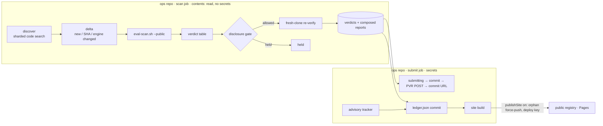

# Public Crawler - Plan

## Goal Capsule

- **Objective:** Blastgate reaches repos without maintainers running or installing anything. A crawler that Jay operates does five things:
  - finds public repos that run AI agents in CI;
  - scans them;
  - publishes the ones that pass;
  - privately reports the ones that fail;
  - lists credited advisories once maintainers fix them.
- **Product authority:** Jay's 2026-09-30 direction ("this can't be a tool people have to run"; no GitHub App) → this plan → `STRATEGY.md`.
  - The Distribution track in `STRATEGY.md` still says "no one adopts what they can't install". U10 updates it.
  - The fail contract (`docs/plans/2026-09-29-001-feat-precision-core-plan.md`) and the agent verdict (`docs/plans/2026-10-01-001-feat-agent-in-ci-model-plan.md`) decide what fails and what passes. This plan changes neither.
- **Execution profile:**
  - TDD per repo `CLAUDE.md` §2: write the failing test for each unit first.
  - One commit per unit on `feat/public-crawler`.
  - Merging to `main` is human-only.
- **Stop conditions:** stop and ask
  - before creating the private ops repo, the public registry repo, or any credential;
  - before the first live (non-dry-run) report is submitted;
  - before the first public site push;
  - if a dry-run crawl produces a fail or a pass that hand review cannot confirm;
  - if GitHub returns an abuse or secondary-rate-limit response.
- **Open blockers:** ticket 0070 must be closed before the pass list is first published. Today a claude-code-action step with default tools is assumed to have no file or env read, so a vulnerable repo could be listed as a pass. This is in the Definition of Done.
- **Product Contract preservation:** doc review on 2026-10-01 found 3 defects, 7 security and reliability gaps, and 2 judgment calls. Jay chose to fold all of them in. Changes:
  - R5 now also forbids leaking removals through the registry's history.
  - R7 now requires escaping every field taken from the repo.
  - Badge output moved to Deferred.
  - No other scope change.

---

## Product Contract

### Summary

A scheduled crawler discovers public GitHub repos whose workflows use a recognized AI agent action. It scans them with the existing engine and records each result against the commit SHA. It publishes a public list of repos that pass. It reports each proven exploit privately to the maintainer through GitHub private vulnerability reporting (PVR). A fail is never published.

### Problem Frame

- Blastgate works, but only for people who run it. Every adoption path so far needs a maintainer to act: the CLI, the Action, the Claude Code plugin, and `scripts/rollout-blastgate.sh`. Jay judged that none of them will get traction.
- The strategy's "Public evidence" track already calls for a large scan of public agent-in-CI repos plus responsible disclosures. The 50-repo eval harness (`scripts/eval-scan.sh`) is a hand-run version of that.
- Prior art shows the approach is accepted. Aikido's PromptPwnd disclosures went through vendor programs, and Gato-X disclosed repo by repo.
- The documented risk is maintainer backlash against bulk, low-quality, or automated reports.

### Key Decisions

- **No maintainer action, ever.** Distribution is a crawler Jay operates. Install-based and App-based adoption are out. Governs R1, R6. (session-settled: user-directed — chosen over CLI/Action adoption and a GitHub App, 2026-09-30.)
- **Only passes are public.** Unsolicited fails go only to the maintainer, through private reporting. Governs R5, R7. (session-settled: user-directed, 2026-09-30.)
- **Fails are auto-submitted through the PVR API.** Governs R7, R8. (session-settled: user-directed — chosen over "crawler drafts, Jay sends" and "Jay flags verified, crawler sends": scales without Jay in the loop. KTD6 adds the guardrails that make it safe.)
- **The crawler runs on GitHub Actions cron.** (session-settled: user-directed — chosen over local launchd and a new GCP project.)
- **The pass list is a GitHub Pages site.** (session-settled: user-directed — chosen over a markdown file and a Claude artifact.)
- **Scorecard upstreaming gets a design note and a ticket, not implementation.** (session-settled: user-directed — chosen over a full Go port track and over leaving it out.)

### Requirements

**Discovery**

- R1. The crawler finds public, non-fork, non-archived repos whose default-branch workflows reference a recognized agent action: `claude-code-action`, `codex-action`, `run-gemini-cli`, or `actions/ai-inference`.
  - It stays within GitHub's code-search limits.
  - It reports any part of the search it could not cover.
  - A repo name that is not a plain `owner/repo` is dropped.
- R2. Each run scans only these repos, within a per-run cap:
  - repos that are new;
  - repos whose default-branch SHA changed;
  - repos whose last scan used an older engine version.

**Scanning**

- R3. Scans use the shipped engine through `scripts/eval-scan.sh`, with `--public`.
  - A clone that cannot be completed is `clone-failed`, never a pass (0066).
  - Any run the engine could not evaluate is `unknown`, never a pass.
- R4. A private ledger records every result against the repo, its full SHA, and the engine version. It also records every disclosure.

**Publishing**

- R5. The public site lists only repos whose verdict is `pass`, meaning zero findings: no fail, warn, or unknown.
  - Each entry shows the short SHA and the scan date.
  - The site never shows a finding, warn, or fail, or the scanned population.
  - The site's git history never reveals that a repo was removed.
- R6. The site explains what a pass means. It means no proven attacker path to a secret or code-write credential was found at that SHA, as of that date, by that engine version. It is not a security guarantee.

**Disclosure**

- R7. A fail that clears the disclosure gate (KTD6) is reported once, through the PVR API.
  - The report is labeled as automated and gated to proven paths.
  - It carries:
    - the path;
    - the `file:line` evidence;
    - why the path is reachable;
    - the fix;
    - the OWASP labels;
    - the Blastgate version and the SHA.
  - Every field taken from the repo is escaped.
  - It never carries the illustrative payload.
- R8. Some fails are held in the private ledger for Jay instead of being filed:
  - a fail that does not clear the gate;
  - a fail whose repo has PVR disabled;
  - a fail whose submission state is uncertain.

  A held fail is never filed as a public issue.
- R9. When a reported repo's advisory is published with the reporter credited, the site lists it as a credited advisory.

**Strategy**

- R10. `STRATEGY.md` reflects crawler-led distribution and names the Scorecard track.

### Acceptance Examples

- AE1. A discovered repo scans `pass` at SHA `abc123…` with engine version V. The site lists it, and the next run skips it while both the SHA and V are unchanged.
- AE2. A repo scans `warn`. It is not on the site and nothing is filed.
- AE3. A repo scans `fail` on an allowlisted archetype, PVR is enabled, and the kill switch is off. One report is filed and the ledger records the report URL. A later run never files again for the same finding ids.
- AE4. A repo scans `fail` but PVR is disabled. The fail is held in the ledger and nothing outbound is sent.
- AE5. A repo was fixed between discovery and submission. A fresh clone at its current HEAD passes, so nothing is filed and the ledger records "resolved before report".
- AE6. A previously listed repo's new SHA fails. It disappears from the site on that run, and the registry history shows only a fresh snapshot, not a removal.
- AE7. The run crashes after a report is filed but before the URL is recorded. The next run finds the `submitting` entry, holds it for Jay, and does not file again.

### Scope Boundaries

- No GitHub App, no PRs or badges added to other people's repos, and no public issues.
- Only repos with an agent action. The wider CI or dependency population is out of scope.
- The site is static. There is no hosted service and no per-repo opt-in UI.
- No change to engine verdicts. A false fail is fixed in the engine and never special-cased in the crawler.

#### Deferred to Follow-Up Work

- Contact requests ("please enable PVR") for repos with a held fail and no private channel.
- Discovery beyond REST code search, such as the new-syntax search, GH Archive, or BigQuery.
- The Scorecard implementation and its upstream PR. U9 files the ticket.
- Self-serve shields.io badge JSON for maintainers who want one.
- Deduplicating reports across a workflow rename. Finding ids are path-based, so a renamed workflow gets new ids.

### Dependencies / Assumptions

- Ticket 0070 is closed before the first publish (Open blockers).
- Jay creates the following, per the U8 runbook:
  - a **private ops repo** (`jwolberg/blastgate-crawl`) that runs the cron and holds the ledger;
  - a **public registry repo** (`jwolberg/blastgate-registry`) that serves Pages;
  - **two credentials**: a deploy key scoped to the registry repo, and a reporting token used only for PVR calls.
- Unverified: a non-collaborator's `GET /repos/{o}/{r}/private-vulnerability-reporting` returns the real `enabled` value. U5 verifies this against a known repo before relying on it.

### Outstanding Questions

- **Token type and reporter identity.** Which token type can file PVR on third-party repos? Should it belong to a dedicated machine account so an abuse flag cannot reach Jay's personal account? Settle empirically in U5. If a classic PAT is needed, record that as an explicit risk acceptance in the runbook. R9's "reporter credited" means whichever account files.
- **Held fails on repos without PVR.** These have no outbound path until contact requests (Deferred) land. The runbook gives Jay a manual review cadence.
- **Re-scan validity.** A pass stays listed until its SHA or the engine version changes, and the scan date is shown. Revisit after the first month.

### Sources / Research

- Code search allows 10 requests a minute and at most 1,000 results per query, searches the default branch only, and uses legacy syntax over REST — https://docs.github.com/en/rest/search/search#search-code
- PVR create (`POST /repos/{o}/{r}/security-advisories/reports`): `summary` and `description` are required, and the reporter is credited automatically — https://docs.github.com/en/rest/security-advisories/repository-advisories#privately-report-a-security-vulnerability
- PVR enabled check — https://docs.github.com/en/rest/repos/repos#check-if-private-vulnerability-reporting-is-enabled-for-a-repository
- Secondary limits: at most 80 content-creating requests a minute and 500 an hour — https://docs.github.com/en/rest/using-the-rest-api/rate-limits-for-the-rest-api
- The AUP prohibits "automated excessive bulk activity … such as spamming" — https://docs.github.com/en/site-policy/acceptable-use-policies/github-acceptable-use-policies
- Pages on GitHub Free requires a public repo, and public Actions logs and artifacts are readable by anyone — https://docs.github.com/en/pages/getting-started-with-github-pages/creating-a-github-pages-site
- Prior art:
  - Aikido PromptPwnd — https://www.aikido.dev/blog/promptpwnd-github-actions-ai-agents
  - Gato-X — https://github.com/AdnaneKhan/gato-x
  - CSA note on AI-found reports — https://labs.cloudsecurityalliance.org/research/csa-research-note-ai-vulnerability-disclosure-policy-reform/
- Local:
  - `scripts/eval-scan.sh`
  - `docs/learnings/eval-sparse-clones-go-empty.md`
  - `docs/evaluations/2026-10-01-agent-model-rescan.md` (2 known false fails on gh-aw lock files; 0062 iceboxed)

---

## Planning Contract

### Key Technical Decisions

- **KTD1. Private and public are split across repos, credentials, and jobs.**
  - The `blastgate` repo is public, so its Actions logs and artifacts are world-readable, and Pages on Free needs a public repo. The crawler workflow, credentials, ledger, and scan outputs therefore live in a private ops repo.
  - Two credentials:
    - a deploy key that can write only to the registry repo;
    - a reporting token used only for PVR calls.
  - Two jobs:
    - a **scan job** that discovers, clones, scans, and re-verifies, with `contents: read` and no secrets;
    - a **submit job** that holds the secrets and never clones or parses a target repo.

    The scan job hands the submit job only verdicts, finding ids, archetypes, and composed reports.
  - Crawler code lives in `blastgate` and is tested by its CI. The ops repo checks it out by commit SHA. Every third-party action is pinned by SHA, and the build installs with `npm ci --ignore-scripts`.
- **KTD2. Discovery shards REST code search.**
  - One query per agent action literal, restricted to workflow files.
  - A shard with 1,000 or more hits is split by `size:` ranges.
  - A single-size bucket that is still over the cap (copy-pasted quickstarts) is split again by `filename:` variants.
  - Recursion depth is capped, and a shard that stays over the cap is reported as `truncated`.
  - Searches are throttled under 10 a minute.
  - Results are deduplicated, names are checked against a strict `owner/repo` pattern, and repos are filtered on metadata: public, not a fork, not archived.
- **KTD3. Scanning reuses `eval-scan.sh`, with three fixes.**
  - The script emits full 40-character SHAs; the site shortens them for display.
  - The crawler derives the verdict from an explicit table, not from the exit code alone:

    | Scan result | Verdict |
    |---|---|
    | exit 0, no findings | pass |
    | exit 0, warn-tier findings only | warn |
    | any fail-tier finding | fail |
    | exit 1 with no fail finding, exit > 1, or unparseable JSON | unknown |
    | clone could not be completed | clone-failed |

  - Re-verify runs in a fresh, run-scoped workdir and checks that the scanned SHA equals the remote HEAD, so a cached clone can never vouch for a stale tree.
- **KTD4. The ledger is one JSON file in the ops repo, committed as it changes.**
  - Per repo it records the full SHA, the engine version, the verdict, the scan date, and the fail finding ids and archetypes.
  - Per disclosure it records the finding ids, the state, the report URL, and timestamps.
  - Scan details can be rederived; disclosure history cannot (applied prior: store only what cannot be derived).
  - Before each report, the ledger is committed with a `submitting` state. The report URL is committed right after the POST.
  - A `submitting` entry found at startup is held, never retried.
  - The workflow allows one run at a time (a `concurrency` group without cancellation).
- **KTD5. The pass list is verdict `pass` only.**
  - Anyone can rebuild the crawled population from code search, so absence from the list is a signal.
  - Warns, unknowns, and clone failures stay off the list along with fails, which keeps absence ambiguous. On the eval sample, warns outnumber real fails many times over.
- **KTD6. Guardrails on auto-submit.** These are a conflict call-out on the session-settled auto-submit decision: the decision stands, and the guardrails make it survivable. The 2026-10-01 re-scan had 2 false fails out of 2, and a false fail filed automatically reaches a stranger under Jay's name.
  1. **Disclosure gate:** only fails whose archetype is on an allowlist in the ops config are auto-submitted. The allowlist starts empty.
  2. **Allowlist bar:** an archetype is admitted only after U11 hand-confirms at least 20 fails for it across at least 10 owners, with zero refuted. A maintainer reporting a false positive sends that archetype back to held (tripwire).
  3. **Dry-run defaults:** `submitMode` and `publishSite` are both off until Jay turns them on in config. In dry run, the crawler records the exact report it would send.
  4. **Re-verify at submit (staleness only):** fresh-clone and re-scan at the current HEAD before posting (KTD3). This catches repos fixed since discovery. It cannot catch a false fail, because a false fail reproduces; only the allowlist guards against those.
  5. **Once per finding:** never re-file finding ids already reported to that repo (KTD4).
  6. **Throttle:** at most 5 reports an hour and 20 a day, far under the content-creation limits and the AUP spam line.
  7. **Kill switch:** a file in the ops repo stops all outbound writes on the next run, whatever the config says. It is kept separate from `submitMode` so an emergency stop needs no config edit.
  8. **Back off on abuse:** any 403 or 429 from the PVR endpoint stops submission for the rest of the run and is flagged in the run summary.
- **KTD7. Reports are plain, labeled, and escaped.**
  - The summary is at most 1,024 characters.
  - The description reuses the per-finding markdown block from `src/cli/render.ts`, exported for this purpose. The disclosure module writes the header and footer itself, not `renderMarkdown`'s gate-oriented wrapper.
  - Every field that comes from the repo is escaped and length-capped, so links, @mentions, HTML, and control characters render inert. That covers paths, step names, and labels.
  - No payload: an advisory the maintainer publishes would make it public.
  - The report states:
    - the finding came from automated scanning, gated to proven paths;
    - a link to Blastgate's threat model;
    - how to respond or decline;
    - a suggested 90-day coordinated-disclosure window.
- **KTD8. Static site, published without history.**
  - One `index.html` with three parts: passes, credited advisories, and a method section (R6). Inline styles and no client JS, like `src/report/trend.ts`.
  - Each publish force-pushes a single orphan commit to the registry's Pages branch, so no removal diff persists (R5, AE6).
  - The ops ledger keeps the audit trail privately.
- **KTD9. Crawler code lives in `src/crawl/` but stays out of the npm package.** It has its own tsup entry (`dist/crawl/index.js`), and a negated `files` pattern keeps it out of the package. It is internal tooling, not product surface.

### High-Level Technical Design

Disclosure states: `held` → `queued` → `submitting` → `submitted` → (`fixed` | `declined` | `published-credited`). There is also `resolved-before-report`. A held fail can return to `queued` when Jay allowlists its archetype. A `submitting` entry left behind by a crash becomes `held`.

### Sequencing

- U1, U2, U9, and U10 have no dependencies.
- U3 needs U2. U4 needs U2. U5 needs U3 and U4.
- U6 needs U5. U7 needs U2 and U6.
- U8 wires everything together.
- U11 is last. It is the human gate before any live report or public push.

---

## Implementation Units

### U1. Discovery via sharded code search

**Goal:** produce the deduplicated set of candidate repos (R1).
**Requirements:** R1, KTD2.
**Dependencies:** none.
**Files:**
- `src/crawl/github.ts`: a fetch wrapper with an injectable transport, rate limiting, `retry-after` handling, and `incomplete_results` handling.
- `src/crawl/discover.ts`
- `src/crawl/discover.test.ts`
- `test/fixtures/crawl/search/*.json`: recorded API pages.

**Approach:**
1. Build one query per action literal, scoped to workflow files.
2. Split a saturated shard by `size:`, then by `filename:` variants, up to a depth cap.
3. Page through each shard, collecting `owner/repo`.
4. Drop names that fail the strict pattern.
5. Fetch metadata and keep public, non-fork, non-archived repos.

**Patterns to follow:** the agent profiles in `src/analyzers/ci/agents.ts`, so discovery and the engine recognize the same set.
**Test scenarios:**
- Overlapping shards produce each repo once.
- A shard reporting `total_count: 2400` is split until every sub-shard is under 1,000.
- A single-size bucket still over the cap is split by filename. One that still cannot get under the cap is reported `truncated`, and discovery terminates.
- A page with `incomplete_results: true` is retried once. If it stays incomplete, the shard is reported partial.
- Forks, archived repos, and private repos are dropped.
- Names such as `../x`, `a/b/c`, or `a b/c` are dropped.
- The transport never sees more than 10 search requests in any 60-second window.
- A 403 secondary-limit response honors `retry-after` and does not drop the shard.

**Verification:** against the recorded fixtures, discovery yields the expected set within the request budget and reports any truncation.

### U2. Crawl ledger

**Goal:** durable private state for scans and disclosures (R2, R4).
**Requirements:** R2, R4, R8, KTD4.
**Dependencies:** none.
**Files:**
- `src/crawl/ledger.ts`
- `src/crawl/ledger.test.ts`

**Approach:**
- A versioned JSON schema holds per-repo scan state (full SHA, engine version, verdict, date, fail ids and archetypes) and per-disclosure state.
- Pure transition functions reject illegal moves.
- The delta takes current HEAD SHAs (from `git ls-remote`, run with bounded parallelism) and returns repos that are new, changed, or scanned by an older engine. Listed passes on an old engine come first, then the oldest scans, up to the per-run cap.
- A repo whose HEAD cannot be resolved is skipped for that run, not scanned.

**Patterns to follow:** `src/report/run-record.ts` (schema version, tolerant parse).
**Test scenarios:**
- Covers AE1: an unchanged full SHA and engine version keep a repo out of the delta.
- A changed SHA puts the repo in the delta.
- An older engine version on a listed pass puts it in the delta, ahead of new repos.
- The per-run cap returns the highest-priority repos first.
- A repo whose `ls-remote` fails is skipped and reported.
- `submitted` → `queued` is rejected, and `held` → `queued` is allowed.
- Covers AE7: at startup, a `submitting` entry becomes `held` with reason "submission state uncertain".
- A disclosure for finding ids already `submitted` on that repo cannot be created again.
- A malformed ledger fails loudly. It is never silently reset to empty, because an empty ledger would re-file reports.

**Verification:** a ledger round-trips through write and parse without loss, and every illegal transition throws.

### U3. Scan and ingest

**Goal:** scan the delta and record verdicts (R3).
**Requirements:** R3, R4, KTD3.
**Dependencies:** U2.
**Files:**
- `src/crawl/scan.ts`
- `src/crawl/scan.test.ts`
- `scripts/eval-scan.sh`: emit the full SHA.
- `test/eval-scan.test.ts`: update the SHA expectation.

**Approach:**
1. Write the delta as a repo list.
2. Run `scripts/eval-scan.sh` with `SCAN_FLAGS=--public` into a workdir. A cached workdir is used for the bulk scan, and a fresh run-scoped one for re-verify.
3. Read `index.tsv` and the per-repo JSON, and apply the KTD3 verdict table.
4. Record the engine version from the built CLI.
5. Payloads never enter the ledger.

**Execution note:** reuse the offline harness in `test/eval-scan.test.ts` (a `file://` remote plus a stub CLI) so tests run the real script.
**Test scenarios:**
- A stub returns pass, warn, fail, and clone failure. The ledger gets each verdict, and a clone failure is never `pass`.
- A stub exits 1 with zero fail findings and the result records `unknown`.
- A stub exits 2 with empty output and the result records `unknown`.
- `index.tsv` carries a 40-character SHA.
- Payload text in the stub output appears nowhere in the ledger.
- Covers AE5: a repo is fixed upstream after a cached scan, and re-verify in a fresh workdir sees the new HEAD, passes, and records `resolved-before-report`.

**Verification:** an end-to-end run on the local harness produces the expected ledger entries.

### U4. Disclosure gate and report composer

**Goal:** decide whether each fail is auto-submitted or held, and render the exact report (R7, R8).
**Requirements:** R7, R8; KTD6 steps 1–3 and 5; KTD7.
**Dependencies:** U2.
**Files:**
- `src/crawl/disclose.ts`
- `src/crawl/disclose.test.ts`
- `src/crawl/config.ts`: the ops config schema, with `allowlist`, `submitMode`, `publishSite`, and throttle settings.
- `src/cli/render.ts`: export the per-finding markdown block.
- `src/cli/render.test.ts` or the existing report test.

**Approach:** pure functions.
- The gate takes a fail, the config, and the ledger, and returns `allowed` or `held` with a reason.
- The composer builds `summary` and `description` from the exported per-finding block, plus a disclosure header and footer.
- Every field taken from the repo is escaped and capped.

**Patterns to follow:**
- `markdownFinding` in `src/cli/render.ts`
- `withoutPayload` in `src/findings/finding.ts`

**Test scenarios:**
- With an empty allowlist, every fail is `held` with reason "archetype not allowlisted".
- An allowlisted archetype with `submitMode` off is `allowed` and marked as a dry run.
- Finding ids already reported are `held` as a duplicate.
- The summary is at most 1,024 characters for the longest fixture path.
- The description contains:
  - the `file:line` evidence;
  - the fix;
  - the OWASP labels;
  - the version and the SHA;
  - the automated-scan notice.
- The description contains no payload text for a fail fixture that has one.
- A workflow path or step name containing a markdown link, an `@mention`, ``, or a control character renders inert in the description.
- The exported per-finding block matches `renderMarkdown`'s finding section byte for byte.

**Verification:** snapshot reports for the incident fixtures in `test/fixtures` read correctly on hand review.

### U5. PVR submitter

**Goal:** file allowed reports safely (R7, R8).
**Requirements:** R7, R8; KTD4; KTD6 steps 4–8.
**Dependencies:** U3, U4.
**Files:**
- `src/crawl/submit.ts`
- `src/crawl/submit.test.ts`

**Approach:** this code runs in the submit job.
1. Check the kill switch.
2. Check the throttle budget against the submission timestamps in the ledger.
3. Pre-check whether PVR is enabled. If it is not, hold with reason "no PVR".
4. Consume the scan job's re-verify result: post only if the same finding ids still fail at the current HEAD.
5. If `submitMode` is off, record the would-send report and stop.
6. Otherwise mark the entry `submitting` and persist the ledger, then POST, then record the URL and persist again.
7. Stop all submission on a 403 or 429.

**Execution note:** the first live call is the U11 human gate. Before it, settle the token-type question against a test repo Jay owns that has PVR enabled.
**Test scenarios:**
- Covers AE4: with PVR disabled, the entry is `held` and no POST is attempted.
- With the kill-switch file present, no POST is made for any repo and the run summary says why.
- A sixth submission within an hour is deferred to a later run, not dropped.
- A 429 on the first POST stops further POSTs this run, and the rest stay `queued`.
- Covers AE3: success records the URL, and the next run with the same ids makes no POST.
- Covers AE7: the persist hook is called with `submitting` before the transport sees the POST.
- In dry run, the full request body is recorded and the transport sees zero POSTs.

**Verification:** a recorded-transport test asserts the exact request and persist sequence for each scenario.

### U6. Advisory tracker

**Goal:** learn when reported issues are fixed or published (R9).
**Requirements:** R9; KTD6 step 2 (tripwire).
**Dependencies:** U5.
**Files:**
- `src/crawl/track.ts`
- `src/crawl/track.test.ts`

**Approach:** for each `submitted` disclosure, read the advisory state and update the ledger.

| Advisory state | Ledger change |
|---|---|
| `published`, reporter credited | `published-credited`, with the GHSA id |
| `published`, reporter not credited | `fixed` |
| `closed` or withdrawn | `declined` |
| closed as a false positive | `declined`, and the archetype goes back to held (tripwire) |
| newer SHA no longer fails | `fixed` |

**Test scenarios:**
- A published, credited advisory becomes `published-credited` and records the GHSA id.
- A published advisory without the credit becomes `fixed` and is not listed.
- An advisory closed as a false positive becomes `declined`, and its archetype leaves the allowlist effect.
- A 404 leaves the state unchanged and is flagged in the run summary.

**Verification:** recorded responses drive each transition.

### U7. Static site

**Goal:** the public pass list and the credited advisories (R5, R6, R9).
**Requirements:** R5, R6, R9; KTD5; KTD8.
**Dependencies:** U2, U6.
**Files:**
- `src/crawl/site.ts`
- `src/crawl/site.test.ts`

**Approach:**
- Render `index.html` from the ledger with three parts:
  - passes: repo, short SHA, scan date, engine version;
  - credited advisories: repo and GHSA link;
  - the method section with the R6 wording.
- Output is deterministic.

**Patterns to follow:** `src/report/trend.ts`.
**Test scenarios:**
- Covers AE2 and AE6: a ledger with pass, warn, fail, unknown, and clone-failed repos renders only the pass. Fail, warn, and unknown repo names, finding text, and counts appear nowhere.
- A pass whose SHA later failed is absent.
- Only `published-credited` advisories render.
- Repo names with HTML metacharacters are escaped.
- Rendering the same ledger twice gives byte-identical output.

**Verification:** a snapshot of the rendered site for a mixed fixture ledger.

### U8. Ops wiring and runbook

**Goal:** make the crawler run on a schedule.
**Requirements:** R1–R9; KTD1; KTD4; KTD8; KTD9.
**Dependencies:** U1–U7.
**Files:**
- `src/crawl/index.ts`: the orchestrator, with `scan` and `submit` entry points.
- `src/crawl/publish.ts`: an orphan-commit force-push of the site directory.
- `src/crawl/index.test.ts`
- `src/crawl/publish.test.ts`
- `tsup.config.ts`
- `package.json`: the `files` exclusion.
- `ops/crawl.yml`: the workflow template for the ops repo.
- `docs/runbooks/crawler.md`

**Approach:**
- The workflow template has:
  - a cron trigger and a `concurrency` group;
  - a **scan** job: `contents: read`, no secrets, checks out `blastgate` by SHA, runs `npm ci --ignore-scripts`, builds, then discovers, scans, re-verifies, and uploads its result for the next job only;
  - a **submit** job: holds the reporting token in a protected environment and the deploy key, then submits, tracks, commits the ledger, and publishes when `publishSite` is on.
- Logs print counts only, never repo names paired with verdicts.
- The runbook covers:
  - creating the repos and credentials;
  - token scopes, expiry, and rotation;
  - the config flags;
  - the kill switch;
  - reviewing held fails;
  - an incident procedure for a bad report: kill switch, retract through the advisory thread, revoke the token.

**Execution note:** creating the repos and credentials is Jay's job (stop condition). This unit commits only code, the template, and the runbook.
**Test scenarios:**
- With every stage faked, stages run in order, and a site-build failure still commits the ledger.
- With the default config (`submitMode` and `publishSite` off), there are no POSTs and no publish end to end.
- The run summary has counts and no repo/verdict pairs.
- `publish.ts` produces a single parentless commit on a local bare remote, and a second publish leaves no reachable earlier commit on the branch.
- `npm pack --dry-run` lists nothing under `dist/crawl`.
- The template pins every `uses:` by a 40-character SHA, and no job that clones targets references a secret. Check this with a test that parses `ops/crawl.yml`.

**Verification:** a full orchestrator run on the local harness writes a ledger and a site with zero network writes.

### U9. Scorecard design note and ticket

**Goal:** scope the upstream track (R10).
**Requirements:** R10.
**Dependencies:** none.
**Files:**
- `docs/learnings/scorecard-dangerous-workflow-upstream.md`
- a new backlog ticket

**Approach:**
1. Read the Go source of Scorecard's Dangerous-Workflow check at a pinned commit.
2. Map what it detects against Blastgate's agent Rule-of-Two verdict.
3. Propose the smallest upstreamable addition.
4. Note the maintainer process.

**Test expectation:** none (documentation only).
**Verification:** the note cites Scorecard source paths at a pinned commit, and the ticket links it.

### U10. Strategy update

**Goal:** make `STRATEGY.md` match the distribution decision (R10).
**Requirements:** R10.
**Dependencies:** none.
**Files:** `STRATEGY.md`
**Approach:**
- Rewrite the Distribution track around the crawler and Scorecard.
- Keep npm, the Action, and the plugin as opt-in surfaces.
- Add "repos listed" and "reports acknowledged" to the metrics.

**Test expectation:** none (documentation only).
**Verification:** no remaining claim that adoption depends on installation.

### U11. Dry-run crawl and go-live gate

**Goal:** prove precision and recall on real repos before anything is sent or published.
**Requirements:** R5, R7; KTD6 steps 1–3.
**Dependencies:** U8 and ticket 0070.
**Files:** `docs/evaluations/2026-MM-DD-crawler-dry-run.md`
**Approach:**
1. Run the crawler in dry run.
2. Report the discovered count, any truncated shards, per-repo scan time, and the projected sweep duration. Set the cron cadence and per-run cap from these numbers.
3. Hand-review every fail.
4. Hand-review a random sample of at least 30 passes, weighted to repos whose agents hold secrets with outsider-reachable triggers.
5. Propose the archetypes that meet the KTD6 bar.
6. Jay approves the allowlist and turns on `submitMode` and `publishSite` (stop condition).

**Test expectation:** none (evaluation).
**Verification:**
- Every fail has a hand verdict.
- The pass sample has zero false passes.
- Every proposed archetype meets the 20-fail, 10-owner bar.
- Jay's go-live approval is recorded in the doc.

---

## Verification Contract

- `npm run typecheck`, `npm run lint`, `npm run format:check`, and `npm test` pass on every unit commit.
- No unit test hits the network. GitHub calls go through the injectable transport with recorded fixtures. Scans and publishes go through `file://` and local bare remotes.
- The `code-review` agent reaches its merge bar on the PR.
- The U11 evaluation doc exists, with a hand verdict on every fail and the pass sample, before any live report or public push.

## Definition of Done

- U1–U10 are merged to `main` by Jay, each with tests.
- Ticket 0070 is closed.
- Jay has created the ops repo, the registry repo, and the credentials. The cron runs green in dry run.
- U11 is complete: the precision and recall review is documented, Jay has approved the allowlist, and the site is published.
- The Scorecard ticket is filed and `STRATEGY.md` is updated.
