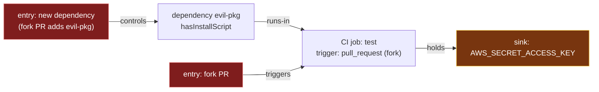

# Blastgate — Threat Model & Cross-Layer Point of View

This document is the written articulation of the attack-path model Blastgate
implements (R15). It states the threat, defines the cross-layer reachable-path
model, positions Blastgate against inventory and single-layer tools, and maps the
model to the OWASP Agentic and MCP taxonomies. It is meant to be read on its own: a
reader should be able to tell what Blastgate does that adjacent tools do not, from
this document alone.

## [1] The threat: the repository is an execution surface

Installing a dependency, or granting a coding agent shell access, is equivalent to
executing untrusted code with the authority of the surrounding environment. The
danger is never the untrusted code in isolation — it is **what that code can reach**
from wherever it runs.

Three forces make this acute in 2026:

- **Supply-chain worms.** The Shai-Hulud npm worm weaponized a `preinstall` lifecycle
  script that runs on `npm install`, sweeps npm / GitHub / AWS / Kubernetes / Vault
  credentials from its execution environment, and propagates to further maintainers.
  The install hook is a foothold; the blast radius is every secret reachable from it.
- **The agent as an execution surface.** A coding agent with committed `.mcp.json` /
  settings grants — filesystem, network, shell — is a standing capability an attacker
  can drive via prompt injection. Over-privilege that is dormant becomes exploitable
  the moment the agent processes untrusted input.
- **Agentic supply chain.** AI-generated agent skills and MCP servers are distributed
  through **unsigned, unaudited marketplaces**. Slopsquatting — a hallucinated package
  name that an attacker then registers — has already propagated through AI-authored
  agent files (the `react-codeshift` hallucination reached ~237 repositories, Jan
  2026). A plugin/skill marketplace is a new, mostly ungoverned distribution channel.

## [2] The gap: nobody computes the cross-layer reachable path

The market inspects each layer in isolation:

- **Dependencies** — Socket, Aikido, Endor score packages and flag risky install
  scripts.
- **CI / Actions** — Harden-Runner and OpenSSF Scorecard's Dangerous-Workflow check
  assess workflow permissions and untrusted triggers.
- **Agent / MCP** — Invariant `mcp-scan`, Cisco `mcp-scanner`, and `mcp-audit` assess
  MCP server configuration.

Each answers "is this layer risky?" None answers the connective question:

> This **new install script** runs in **this CI job** that holds **this secret**,
> which is exfiltratable because the job triggers on **fork pull requests**.

That sentence spans three layers. It is invisible to any tool that sees only one.
The closest by breadth, StepSecurity's Dev Machine Guard, is an **inventory** tool:
it enumerates what exists; it does not compute whether a weakness in one layer can
reach a sensitive resource in another. As of August 2026 the cross-layer reachable
path is unowned, and several vendors are moving toward it — the window to be the
reference implementation is roughly 6–12 months.

## [3] The model: one graph, reachable paths, a gate

Blastgate builds **one directed graph** across three layers and treats the repository
as a testable assertion suite: *no reachable path connects an attacker-controllable
entry point to a sensitive sink.*

### [3.1] Nodes

| Layer | Entry points (attacker-controllable) | Sinks (sensitive) |
| --- | --- | --- |
| Dependencies / install scripts | a newly added or changed dependency; a provenance regression | — |
| CI (GitHub Actions) | a job reachable from an untrusted trigger (fork `pull_request`, `pull_request_target`, `workflow_run`, …) | a secret or credential the job holds; an over-broad `GITHUB_TOKEN` |
| Agent / MCP config | a prompt-injectable agent surface (an over-baseline grant) | a privileged filesystem / network / shell / tool capability |

### [3.2] Edges encode reachability

`controls` (an entry controls a dependency) · `triggers` (untrusted input triggers a
job) · `injects` (injection reaches an agent surface) · `runs-in` (an install script
executes inside a job) · `holds` (a job holds a secret) · `reaches` (a grant reaches a
capability). The one edge no single-layer analyzer can emit — an install-script
dependency **`runs-in`** a CI job — is synthesized by the engine, and only when that
job is attacker-triggerable. That edge is where the cross-layer path becomes real.

### [3.3] The canonical cross-layer path (AE1)

A finding is the shortest path **per (entry, sink)** — so the cross-layer supply-chain
vector (`new dep → dependency → job → secret`) is reported alongside, never hidden
behind, the shorter single-layer CI vector (`fork PR → job → secret`). Each carries a
different remediation.

### [3.4] The gate (precision over recall — R14)

A check fails **only** on a genuinely reachable path to a secret or credential sink.
Syntactic presence never fails a check: a `postinstall` script in a job that holds no
secret and is not attacker-triggerable produces nothing. Lower-sensitivity capability
paths (an over-privileged agent grant) are reported as **warnings**, not failures. A
human can accept a specific finding by id in a committed `.blastgate/acknowledged.json`
— an auditable, per-finding override that downgrades it to a reported warning, never a
silent kill switch.

### [3.5] Blast radius (KD6)

Blastgate reasons over what the **repository and CI declare** — CI secrets and
repo-declared agent grants — not the developer's laptop credentials (`~/.aws`,
`~/.ssh`). A change-time, static analysis of the repo's declared surface; not runtime
proxying and not endpoint monitoring.

## [4] Positioning: what Blastgate is not

| Tool class | Example | What it answers | The gap Blastgate fills |
| --- | --- | --- | --- |
| Inventory | StepSecurity Dev Machine Guard | "What dependencies / tools exist?" | No attack path, no credential reachability |
| Dependency scanner | Socket, Aikido, Endor | "Is this package risky / malicious?" | Blind to where the install script runs and what it reaches |
| Workflow hardening | Harden-Runner, Scorecard Dangerous-Workflow | "Are these CI permissions/triggers risky?" | Blind to which dependency's code executes in the job |
| MCP scanner | Invariant `mcp-scan`, Cisco `mcp-scanner`, `mcp-audit` | "Is this MCP server configured riskily?" | Blind to the CI/secret layer the grant could reach |
| CVE / vuln scanning | Snyk, Socket | "Does this dep have a known CVE?" | Blastgate reasons about reachable paths, not vulnerability databases |

Blastgate is **not** a replacement for these — it is the connective layer that
composes their signals into a reachable path. It does not do deep per-layer rule
coverage, non-GitHub CI, non-npm ecosystems, runtime enforcement, or laptop endpoint
monitoring (see the plan's Scope Boundaries).

## [5] OWASP mapping

Blastgate labels every finding with at most one OWASP Agentic category and at most one
OWASP MCP category. "No applicable category" is valid. Labels are **versioned** so a
renumber is a one-line change and no finding ever carries an unversioned category.

- **Agentic:** OWASP Top 10 for Agentic Applications **2026** (`ASI01–ASI10`) — the
  canonical ranked list.
- **MCP:** OWASP MCP Top 10 (`MCP01–MCP10`) — **draft (v0.1 beta, final ~Oct 2026)**.
  The version is pinned (`:2025`) precisely because the list is not yet final.

### [5.1] Archetype → category

| Finding archetype | Agentic | MCP |
| --- | --- | --- |
| New / changed dependency, install script (supply chain) | `ASI04:2026` Agentic Supply Chain Vulnerabilities | `MCP04:2025` Software Supply Chain Attacks & Dependency Tampering |
| Fork-triggerable CI job reaching a secret (pure CI) | `ASI03:2026` Identity & Privilege Abuse | *(none — no MCP-server relevance)* |
| Prompt-injectable agent surface | `ASI01:2026` Agent Goal Hijack | `MCP10:2025` Context Injection & Over-Sharing |
| Any path through an over-baseline agent grant (scope creep) | `ASI03:2026` (if not already set) | `MCP02:2025` Privilege Escalation via Scope Creep *(takes precedence)* |

Every category Blastgate emits is defined in this table; the full `ASI01–ASI10` and
`MCP01–MCP10` names live in the taxonomy module (`src/taxonomy/owasp.ts`).

### [5.2] OWASP as an asset, not a competitor

The OWASP Agentic and MCP Top 10s are a shared vocabulary, not a rival product.
Blastgate's aim is to be the **open-source reference implementation** of that
taxonomy — the tool that turns the categories into an executable, reachability-based
gate. The real competitive pressure is vendors (Socket, StepSecurity, Harmonic) moving
cross-layer, not the standard itself.

## [6] The dogfood: gating the agent loop from inside it

Blastgate ships as a Claude Code plugin whose hooks enforce the same gate **inside the
agent loop**: a `PreToolUse` hook denies a `git commit` / `git push` or an edit to
`package.json` / `.github/workflows/**` / `.mcp.json` when the change would create a
reachable attacker-to-sink path; a `PostToolUse` hook reacts to `npm install` after the
fact (it cannot prevent, only signal a revert — the asymmetry is the design). The same
engine is also exposed as an advisory `blastgate_check_change` MCP tool and a
`/blastgate` command. The hook is the load-bearing enforcement; the tool and command
are ergonomics and never the sole gate — a prompt-injected agent will not voluntarily
self-check.

This is the on-thesis dogfood: Blastgate reasons about agent over-privilege, and it
runs as an agent-loop plugin that gates the very surface whose over-privilege it
models (R16, R17).
